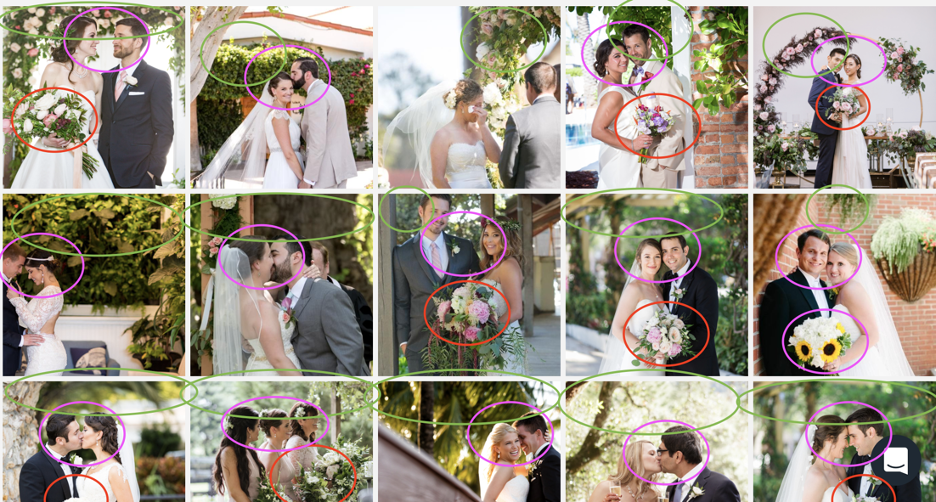

# Training Data

Your custom AI solution will require training data. Training data is used to "teach" AI models how to understand the world. A good set of training data will result in a model that will make accurate predictions on data in real-world scenarios. There are two basic considerations to keep in mind when building a training dataset: quantity and quality.

## Data Quantity

When it comes to training AI models, more training data is generally better. More data means more examples from your model to learn from, and helps you improve the accuracy of your model.

### How many inputs does my model need?

This is one of the most common questions that comes up when building a new model. Unfortunately, there are no hard and fast rules about the number of inputs that will be required for your particular use case. But as a general rule, if you are training a custom model on top of a Clarifai Model, you will need much less training data \(typically tens to tens-of-thousands of inputs\), than if you are building a "deep trained model" \(typically thousands to millions of inputs\).

### Bias

Bias occurs when the scope of your training data is too narrow. If you only see green apples, you’ll assume that all apples are green and think red apples were another kind of fruit. If the training data contains only a small number of examples, it’ll react accordingly, taking it as truth. Small datasets make for a smaller worldview.

## Data Quality

Models that perform well tend to be trained on data that is unique and photographed in a consistent way.

For best results, train your model with data that:

* Adheres to concept descriptions laid out in a taxonomy
* Represents the reality of the use-case
* Has visually noticeable qualities - something that is not too subtle for humans to pick up on AND something that can be picked up through the noise of a photo.

Models that tend to perform poorly:

* Trained on data with inconsistent compositions
* Photos require outside context \(relationships to people in portraits, etc\)
* Subject matter is subtle. Keep in mind, the model has no concept of language, so in essence, “what you see is what you get”.
* Training set is cast too wide. If you train a concept of too many different kinds of images, and they are all visually different, the training set will become noisy. This will make it difficult for the model to find the visually distinct qualities to learn from, resulting in high levels of "variance".


### Cautionary Tale: The importance of representative data when working with User-Generated Content\(USG\)

An international beer company wanted to build a “Perfect Pint” model as part of a promotional campaign. The model was meant to analyze a photo of a pint of beer, and judge how well it had been poured and presented \(this particular brand puts a strong emphasis on the importance of pouring beer with the ideal amount of "head", or foam, on top\).

The client had a few thousand images of professionally photographed pints of beer to use as training data. The images represented their beer in different stages of pour appearance on bar tops, taken in daylight and/or professional lighting.

The initial version of their model struggled to perform effectively in production. Even though their training data provided many examples of the object that they wanted to analyze, the qualitative appearance of their training data did not capture the appearance of their beer in diverse real-world environments.

They needed to provide training data that captured: 1\) The breadth of real world scenarios 2\) The quality of user generated images

After applying these changes, the model performance improved.


### Semantic Clarity \(The importance of "of" vs "in"\)

When labeling an image, try to avoid labeling what is "in" the image, instead you will get better results if you label what the photo is "of". In cases where there are multiple objects in a scene, use a detector model, and label the detected regions separately.


### Cautionary Tale: False positive in wedding imagery

Here is an example of an image of a married couple, which had a false positive prediction for a person holding a bouquet of flowers, even though there is no bouquet in the photo. What’s going on here?

All of these images were labeled with ‘Bouquet-floral\_Holding’:

In this instance, the image in question has:

* A veiled bride
* The Bride & Groom kissing/their heads close together
* Greenery over their heads
* Large, recognizable flowers

The model sees the combination all of these individual things in lots of photos labeled ‘Bouquet\_Floral\_Holding’, and thus, that is the top result.

One way to fix this is to narrow the training data for ‘Bouquet\_Floral\_Holding’ to images in which the bouquet is focal point, rather than any instance of the bouquet being held. This way, the model can focus on the anchoring theme/object within the dataset more easily.


