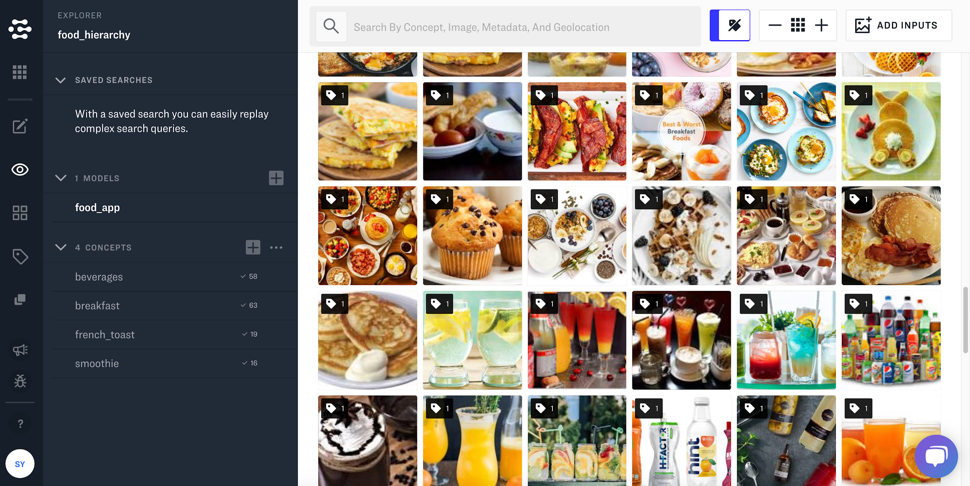
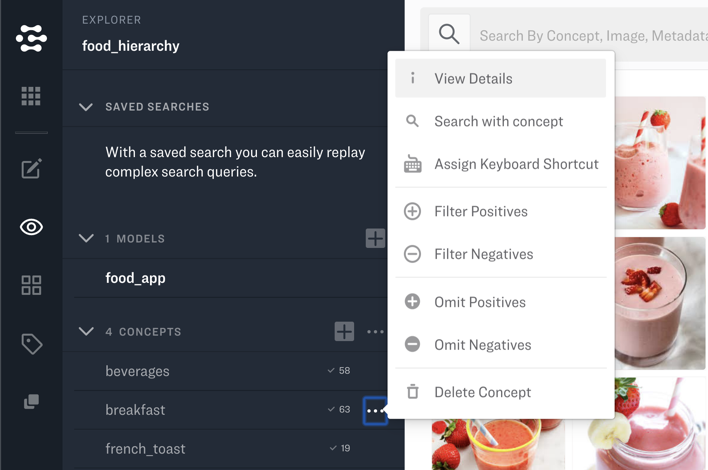
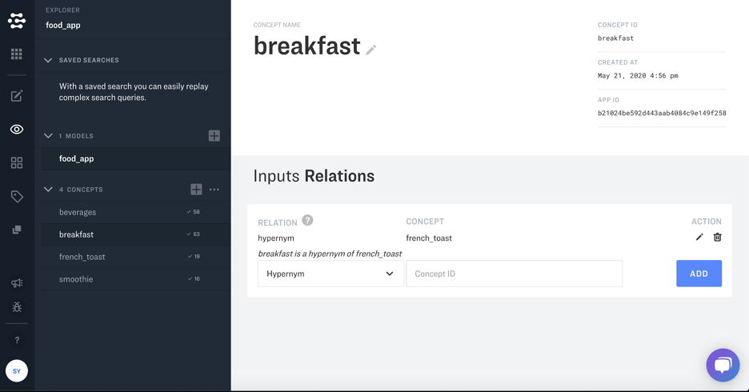
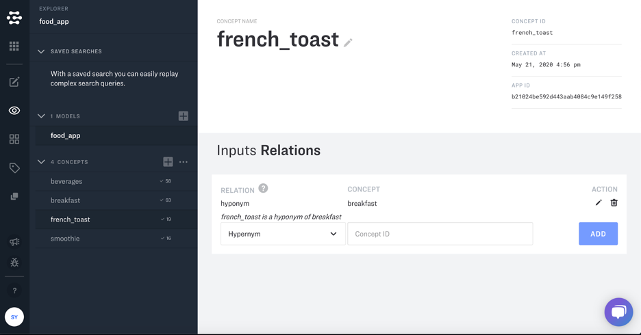
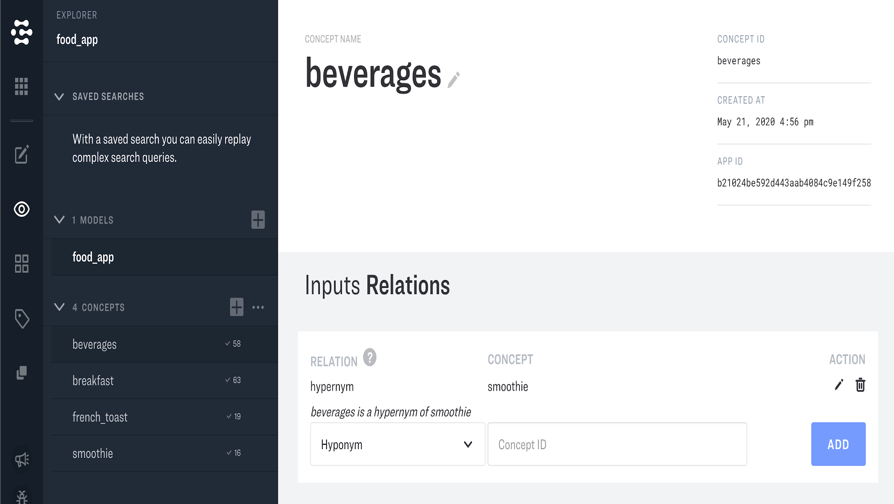
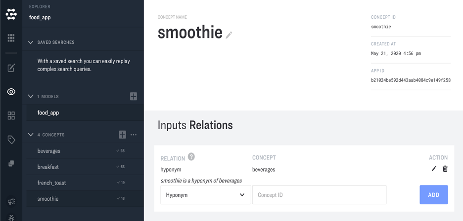

# Knowledge Graph and Concept Relations

The Clarifai Knowledge Graph lets you map your custom concepts to a common set of concepts understood by all applications on the Clarifai platform. The knowledge graph makes it possible to link data across multiple custom and pre-built models in a meaningful way.

The Knowledge Graph uses Clarifai's concept mapping model to establish a hierarchical relationship between your concepts. and to uses three different *predicates* to organize your concepts: hypernyms, hyponyms, and synonyms.

**Hyponym** represents an 'is a kind of' relation. The following relationship: 'honey' (subject), 'hyponym' (predicate), 'food' (object) is more easily be read as 'honey' 'is a kind of' 'food'.

**Hypernym** is the opposite of 'hyponym'. When you add one of the relationships the opposite will automatically appear for you in queries. The 'hypernym' can be read as 'is a parent of' so: 'food' (subject), 'hypernym' (predicate), 'honey' (object) can more easily be read as:'food' is a parent of 'honey'.

**Synonym** The 'synonym' relation defines two concepts that essential mean the same thing. This is more like a "is" relationship. So for example a 'synonym' relationship could be: "puppy" is "pup" The reverse is also true once the former is added so: "pup" is "puppy" will appear in queries as well.


## Create

To create a relation between two concepts, you first have to create them in your custom model. See [the Concepts page](https://docs.clarifai.com/api-guide/concepts/concepts) on how to do that programatically.

Each relation has to have specified a predicate, which can be _hyponym_, _hypernym_, or _synonym_.



```java
import com.clarifai.grpc.api.*;
import com.clarifai.grpc.api.status.*;

// Insert here the initialization code as outlined on this page:
// https://docs.clarifai.com/api-guide/api-overview

MultiConceptRelationResponse postConceptRelationsResponse = stub.postConceptRelations(
    PostConceptRelationsRequest.newBuilder()
        .setUserAppId(
            UserAppIDSet.newBuilder()
                .setAppId("{YOUR_APP_ID}")
                .build()
        )
        .setConceptId("{YOUR_SUBJECT_CONCEPT_ID}")
        .addConceptRelations(
            ConceptRelation.newBuilder()
                .setObjectConcept(Concept.newBuilder().setId("{YOUR_OBJECT_CONCEPT_ID}").build())
                .setPredicate("hypernym").build()) // This can be hypernym, hypnonym, or synonym.
        .build()
);

if (postConceptRelationsResponse.getStatus().getCode() != StatusCode.SUCCESS) {
    throw new RuntimeException("Post concept relations failed, status: " + postConceptRelationsResponse.getStatus());
}
```



```js
// Insert here the initialization code as outlined on this page:
// https://docs.clarifai.com/api-guide/api-overview

stub.PostConceptRelations(
    {
        user_app_id: {
            app_id: "{YOUR_APP_ID}"
        },
        concept_id: "{YOUR_SUBJECT_CONCEPT_ID}",
        concept_relations: [
            {
                object_concept: {
                    id: "{YOUR_OBJECT_CONCEPT_ID}",
                },
                predicate: "hypernym" // This can be hypernym, hyponym, or synonym.
            }
        ]
    },
    metadata,
    (err, response) => {
        if (err) {
            throw new Error(err);
        }

        if (response.status.code !== 10000) {
            throw new Error("Create concept relations failed, status: " + response.status.description);
        }
    }
);
```



```python
from clarifai_grpc.grpc.api import service_pb2, resources_pb2
from clarifai_grpc.grpc.api.status import status_code_pb2

# Insert here the initialization code as outlined on this page:
# https://docs.clarifai.com/api-guide/api-overview

post_concept_relation_response = stub.PostConceptRelations(
    service_pb2.PostConceptRelationsRequest(
        user_app_id=resources_pb2.UserAppIDSet(
            app_id="{YOUR_APP_ID}"
        ),
        concept_id="{YOUR_SUBJECT_CONCEPT_ID}",
        concept_relations=[
            resources_pb2.ConceptRelation(
                object_concept=resources_pb2.Concept(id="{YOUR_OBJECT_CONCEPT_ID}"),
                predicate="hypernym" # This can be hypernym, hyponym, or synonym.
            )
        ]
    ),
    metadata=metadata
)

if post_concept_relation_response.status.code != status_code_pb2.SUCCESS:
    raise Exception("Post concept relation failed, status: " + post_concept_relation_response.status.description)
```



```text
curl -X POST 'https://api.clarifai.com/v2/users/me/apps/{YOUR_APP_ID}/concepts/{YOUR_SUBJECT_CONCEPT_ID}/relations' \
    -H 'Authorization: Key {YOUR_PERSONAL_ACCESS_TOKEN}' \
    -H 'Content-Type: application/json' \
    --data-raw '{
        "concept_relations": [
            {
                "object_concept": {
                    "id": "{YOUR_OBJECT_CONCEPT_ID}"
                },
                "predicate": "hypernym"
            }
        ]
    }'
```




## List existing relations



```java
import com.clarifai.grpc.api.*;
import com.clarifai.grpc.api.status.*;

// Insert here the initialization code as outlined on this page:
// https://docs.clarifai.com/api-guide/api-overview

MultiConceptRelationResponse listConceptRelationsResponse = stub.listConceptRelations(
    ListConceptRelationsRequest.newBuilder()
        .setUserAppId(
            UserAppIDSet.newBuilder()
                .setAppId("{YOUR_APP_ID}")
                .build()
        )
        .setConceptId("{YOUR_CONCEPT_ID}")
        .setPredicate("hypernym")  // This is optional. If skipped, all concept's relations will be returned.
        .build()
);


if (listConceptRelationsResponse.getStatus().getCode() != StatusCode.SUCCESS) {
    throw new RuntimeException("List concept relations failed, status: " + listConceptRelationsResponse.getStatus());
}

for (ConceptRelation relation : listConceptRelationsResponse.getConceptRelationsList()) {
    System.out.println(relation);
}
```



```js
// Insert here the initialization code as outlined on this page:
// https://docs.clarifai.com/api-guide/api-overview

stub.ListConceptRelations(
    {
        user_app_id: {
            app_id: "{YOUR_APP_ID}"
        },
        concept_id: "{YOUR_CONCEPT_ID}",
        predicate: "hypernym" // This is optional. If skipped, all concept's relations will be returned.
    },
    metadata,
    (err, response) => {
        if (err) {
            throw new Error(err);
        }

        if (response.status.code !== 10000) {
            throw new Error("List concept relations failed, status: " + response.status.description);
        }

        for (const relation of response.concept_relations) {
            console.log(relation);
        }
    }
);
```



```python
from clarifai_grpc.grpc.api import service_pb2, resources_pb2
from clarifai_grpc.grpc.api.status import status_code_pb2

# Insert here the initialization code as outlined on this page:
# https://docs.clarifai.com/api-guide/api-overview

list_concept_relation_response = stub.ListConceptRelations(
    service_pb2.ListConceptRelationsRequest(
        user_app_id=resources_pb2.UserAppIDSet(
            app_id="{YOUR_APP_ID}"
        ),
        concept_id="{YOUR_CONCEPT_ID}",
        predicate="hypernym"  # This is optional. If skipped, all concept's relations will be returned.
    ),
    metadata=metadata
)

if list_concept_relation_response.status.code != status_code_pb2.SUCCESS:
    raise Exception("List concept relation failed, status: " + list_concept_relation_response.status.description)

for relation in list_concept_relation_response.concept_relations:
    print(relation)
```



```text
# Setting the predicate GET parameter is optional. If skipped, all concept's relations will be returned.
curl -X GET 'https://api.clarifai.com/v2/users/me/apps/{YOUR_APP_ID}/concepts/{YOUR_CONCEPT_ID}/relations?predicate=hypernym' \
    -H 'Authorization: Key {YOUR_PERSONAL_ACCESS_TOKEN}' \
    -H 'Content-Type: application/json'
```




## Delete



```java
import com.clarifai.grpc.api.*;
import com.clarifai.grpc.api.status.*;

// Insert here the initialization code as outlined on this page:
// https://docs.clarifai.com/api-guide/api-overview

BaseResponse deleteConceptRelationsResponse = stub.deleteConceptRelations(
    DeleteConceptRelationsRequest.newBuilder()
        .setUserAppId(
            UserAppIDSet.newBuilder().setAppId("{YOUR_APP_ID}").build()
        )
        .addIds("{YOUR_CONCEPT_RELATION_ID}")
        .setConceptId("{YOUR_OBJECT_CONCEPT_ID}")
        .build()
);

if (deleteConceptRelationsResponse.getStatus().getCode() != StatusCode.SUCCESS) {
    throw new RuntimeException("Delete concept relations failed, status: " + deleteConceptRelationsResponse.getStatus());
}
```



```js
// Insert here the initialization code as outlined on this page:
// https://docs.clarifai.com/api-guide/api-overview

stub.DeleteConceptRelations(
    {
        user_app_id: {
            app_id: "{YOUR_APP_ID}"
        },
        concept_id: "{YOUR_OBJECT_CONCEPT_ID}",
        ids: [
            "{YOUR_CONCEPT_RELATION_ID}"
        ]
    },
    metadata,
    (err, response) => {
        if (err) {
            throw new Error(err);
        }

        if (response.status.code !== 10000) {
            throw new Error("Delete concept relations failed, status: " + response.status.description);
        }
    }
);
```



```python
from clarifai_grpc.grpc.api import service_pb2, resources_pb2
from clarifai_grpc.grpc.api.status import status_code_pb2

# Insert here the initialization code as outlined on this page:
# https://docs.clarifai.com/api-guide/api-overview

delete_concept_relation_response = stub.DeleteConceptRelations(
    service_pb2.DeleteConceptRelationsRequest(
        user_app_id=resources_pb2.UserAppIDSet(
            app_id="{YOUR_APP_ID}"
        ),
        concept_id="{YOUR_OBJECT_CONCEPT_ID}",
        ids=["{YOUR_CONCEPT_RELATION_ID}"]
    ),
    metadata=metadata
)

if delete_concept_relation_response.status.code != status_code_pb2.SUCCESS:
    raise Exception("Delete concept relation failed, status: " + delete_concept_relation_response.status.description)
```



```text
curl -X DELETE 'https://api.clarifai.com/v2/users/me/apps/{YOUR_APP_ID}/concepts/{YOUR_OBJECT_CONCEPT_ID}/relations' \
    -H 'Authorization: Key {YOUR_PERSONAL_ACCESS_TOKEN}' \
    -H 'Content-Type: application/json' \
    --data-raw '{
        "ids": [
            "{YOUR_CONCEPT_RELATION_ID}"
        ]
    }'
```




You can create these mappings in your application with a few easy steps.  

1. Consider the following application that has four concepts: beverages, smoothie, breakfast, and french_toast. You can use the Knowledge Graph to create hierarchical relationships between the concepts.



2. You can link concepts as hierarchical by going to the details of either of the concepts. In the shown application, french_toast falls under breakfast. You can link them by accessing the View Details section of either concept.



3. Once, in the details dashboard, you can link breakfast as a hypernym to french_toast under the Input Relations menu.



4. Once you list breakfast as a hypernym to french_toast, it will set french_toast as a hyponym to breakfast automatically.



5. This process can be used to create similar relationships between beverages and smoothie. Beverages will be listed as a hypernym to smoothie.



6. By doing this, smoothie will be listed as a hyponym to beverages automatically.


