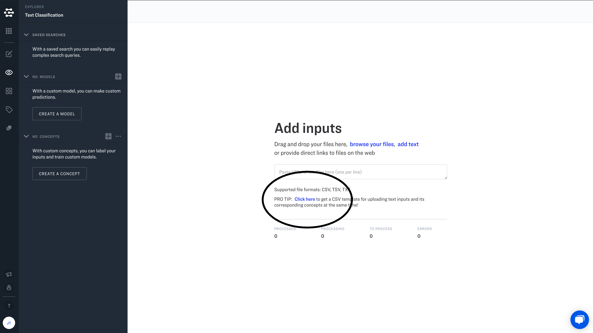

# CSV Uploads

You can upload your inputs directly through a `.csv` file. This means you can work with your favorite spreadsheet software or text editor when preparing your data for upload. Just use the provided "CSV template" on the "Add Inputs" page to get started.

## Inputs

Next, add your text data. At a minimum, you should add at least one input when uploading a `.csv` file. You can do this by:

Entering text in the `input.data.text.raw` field
Entering an image URL in the `input.data.image.url` field
Entering a video URL in the `input.data.video.url` field

## Concept

One advantage of working with `.csv` files, is that it can make bulk labeling of inputs quick and easy. You can add one concept per column to the `input.data.concepts[*].id` fields. For the `input.data.concepts[*].value` column, there are two options: enter the number `1` if the concept *is* present in the input, enter the value `0` if the concept is *not* present in the input (a negative example). If no value is entered, a default value of `1` will be assigned to your input.

You can add columns for as many concepts as you like, and you can add new columns to add values for any other values supported by the API:

|Field     |Description                                                 |
|-----------|--------------------------------------------------------|
|input.id | A unique identifier for your input|
|input.data.text.raw | The "text" for your input |
|input.data.image.url | The URL for you input image |
|input.data.video.url | The URL for your input video |
|input.data.concepts[*].id| Your custom concept |
|input.data.concepts[*].value | The value for your custom concept (`1` for true, `0` for false)|
|input.metadata| Any additional metadata in valid [JSON](https://www.json.org/json-en.html) format |
|input.data.geo.geo_point.latitude| Latitude for geodata |
|input.data.geo.geo_point.longitude | Longitude for geodata |

Finally, you will need to save your work as a `.csv` file. If you are editing in Google Sheets, go to File >>> Download >>> Comma-separated values (.csv, current sheet). If you are using Excel, go to File >>> Save As >>> Browse >>> Save as Type >>> CSV.

Once you have downloaded the `.csv` file, you can then upload it by clicking on “Browse your files” on the  "Add Inputs" page.
