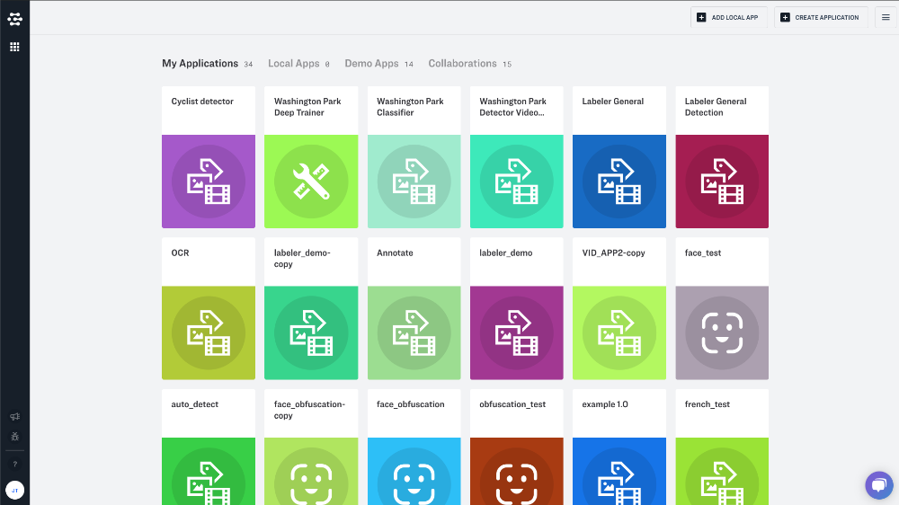
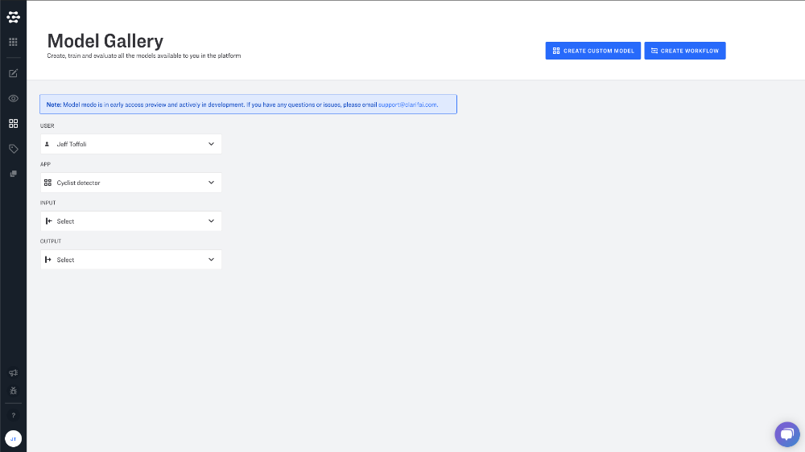
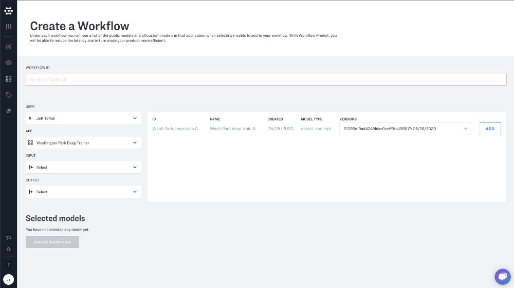

# Workflows

Workflows are a graph of computation that encompass one or more Clarifai or Custom model\(s\). Every workflow is attached to one of your applications. Under each workflow, you will see a list of the Clarifai Models and all custom models in that application when selecting models to add to your workflow. With Workflow Predict, you will be able to run your business logic on one efficient tool.


This won't have any impact on the price you are charged per call. You will still be charged for the same operation if it were separate calls to the API. When you do a predict with a workflow you're charged for the prediction of each model in the workflow as if they were separate calls.


## Workflow Setup

To set up a workflow, you will need to head over to the [Applications page](https://portal.clarifai.com/apps) through your account. From there, you will need to select which application you want to create the workflow under.

Then click on the model mode icon in the lefthand sidebar. From here, click the "Create Workflow" button at the top righthand corner of the screen.

### Create a Workflow

To create a custom workflow, just click the "ADD" button next you the model you would like to add. You will see the model displayed in the "Selected Models" section below. Once added you can configure your input nodes for each model. Model outputs vary based on the type of model that you are working with.

*Workflow ID* Provide a descriptive name for your workflow. This ID will be used to make the API call, so make sure to give it something URL friendly.

*User* Filter your available models by user ID. Be sure to select "Clarifai" if you would like to choose a Clarifai Model.

*APP* Filter your available models based on app


For Clarifai Models, you will be able to use the latest version. For your custom models, you can [select the version of your model](https://github.com/Clarifai/docs/tree/5882f46bd17affcd85ed3e2ec98f4d6f355b58a9/models.md#list-model-versions)&lt;/a&gt;.


You can add up to 20 models to a single workflow. Once you have finished adding everything, press the "Save Workflow" button and that will save the state of your workflow. Now you are ready to predict using your brand new workflow. You can edit a workflow at any time.

