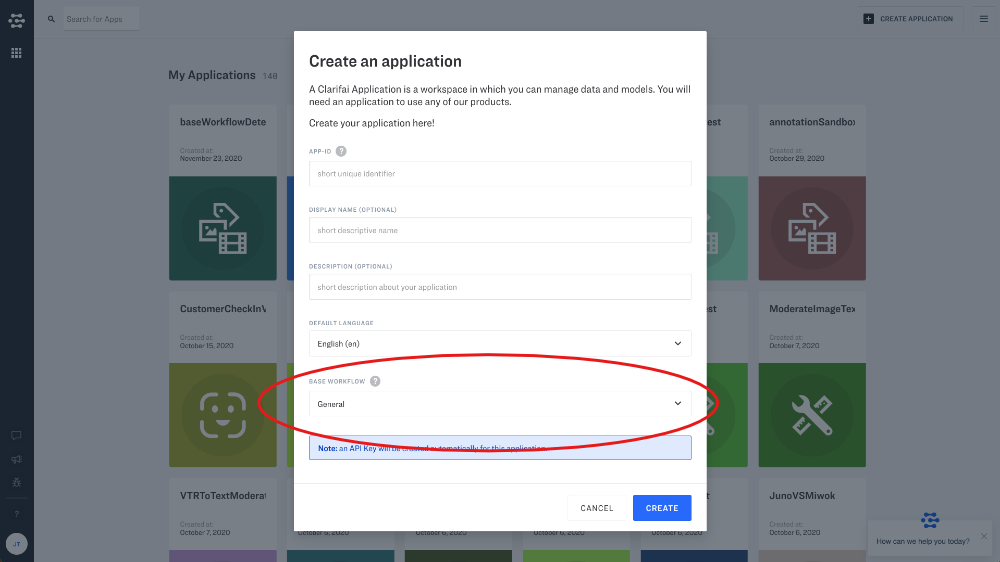
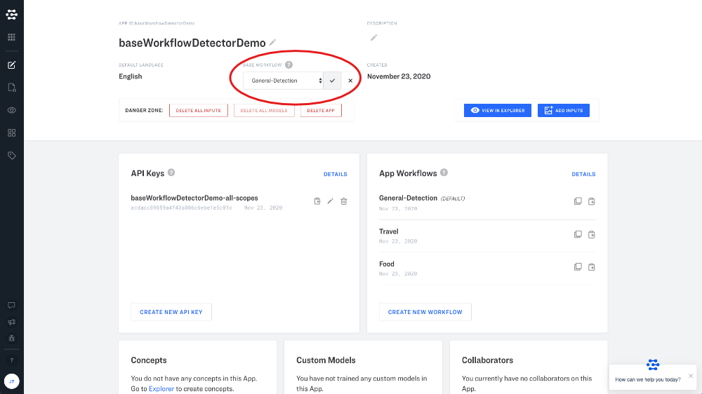

# Base Workflows

The Base Workflow includes one prebuilt Clarifai Model that provides the basic structure for indexing your data. The Base Workflow gives you a "head start" when working with your data, by pre-indexing your inputs for search and by providing a default embedding for your custom models. Your base workflow is what makes your data sortable and searchable as soon as it is uploaded.

Choose a base workflow that you can build upon to create a custom solution. For example, if you're training a custom model around food, you could choose the Food model as your Base Workflow to optimize your custom model performance.

You can choose one Base Workflow per app, and you can change your base workflow once your app is created.

