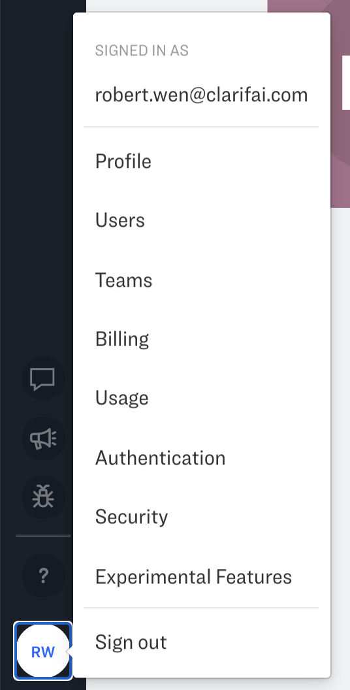
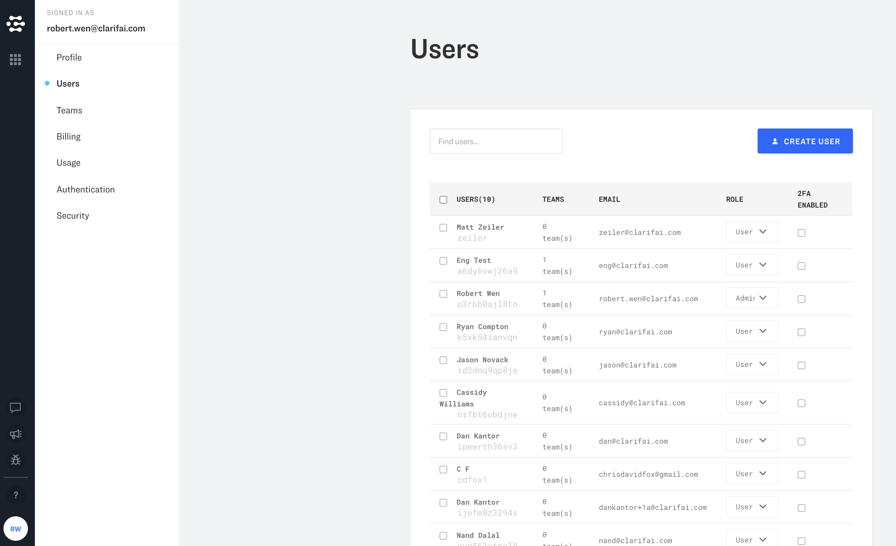
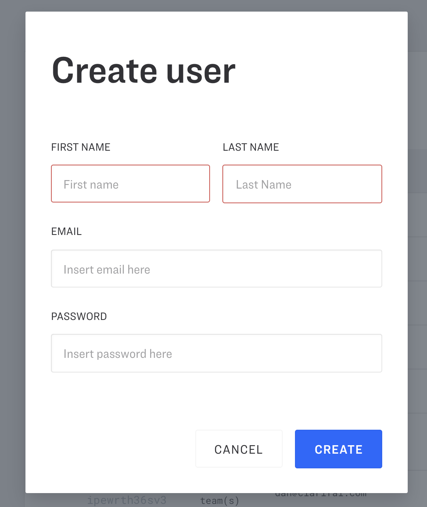
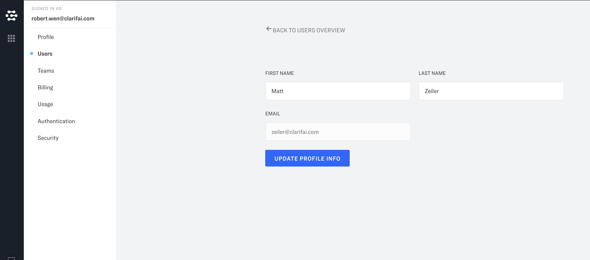
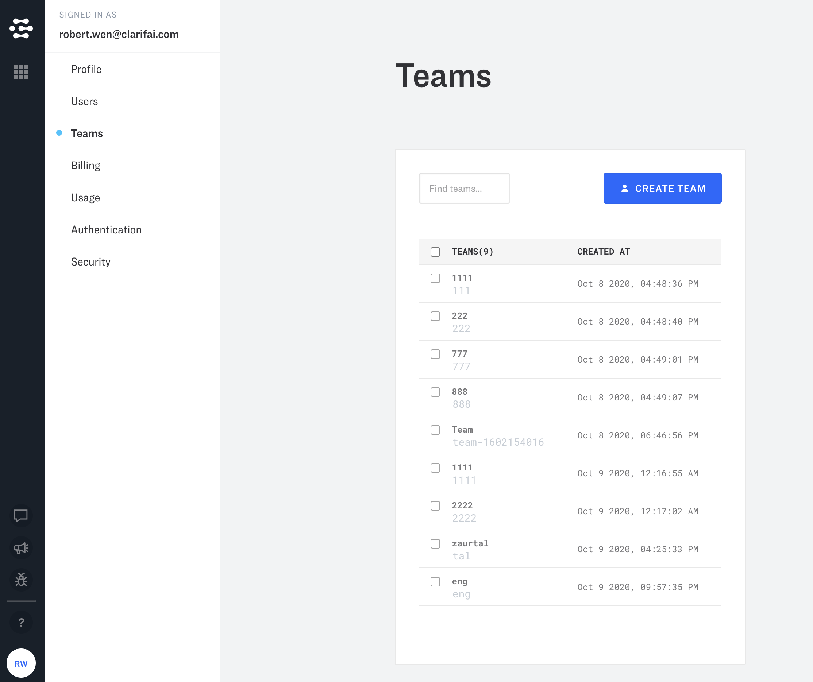

# Role-Based Access Control

Role-based access control \(RBAC\) functionality enables application admins to limit the permissions of some users within a team. It is both a security best practice \(see the principle of least privilege\) and often a compliance requirement for admins to maintain separate accounts for their user level activities.


Currently RBAC is available to our on-premise enterprise customers only. RBAC is coming to cloud customers soon, stay tuned.


## User Management

The administrator of the client will have the full permission on their account, and be able to create, assign and define roles for their own users. User management is one of the core features of organization administrators.

### View Users

Under the users view, it lists the users in the organization. User’s full name, user ID, email, number of teams they are associated with, system role, and the 2nd-factor authentication status are listed.

### Create New Users

The administrator can create a new user under the user management section. This is a straightforward way for the administrator to provision new users to the system. First Name, Last Name, Email and the Password will be needed to create a new user into the system.

### Edit Users

On this page, the administrator is able to change the name and the email for the users.

## Team Management

Team is a holder for a group of users with the same permission settings to the Clarifai applications.

### List Teams

The Administrator is able to see the Teams menu item from the left menu bar.

The listing view gives an overview of all the users within the Name, ID, and Date of Creation. Administrator can also search by keyword.

