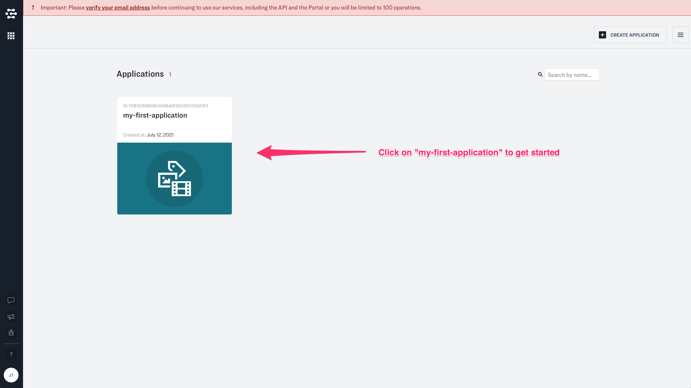
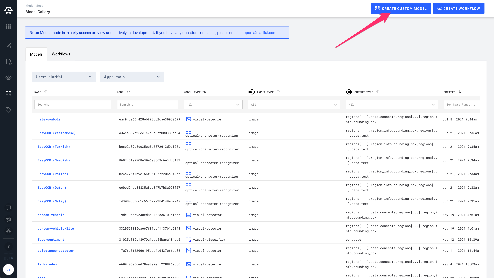
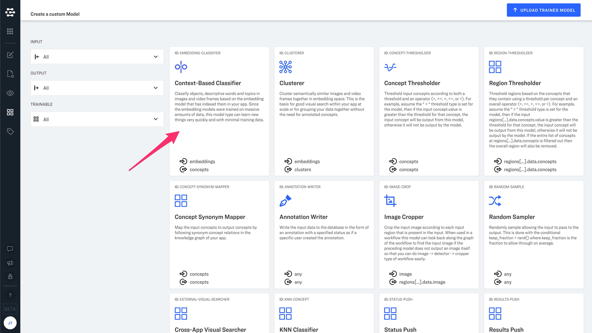
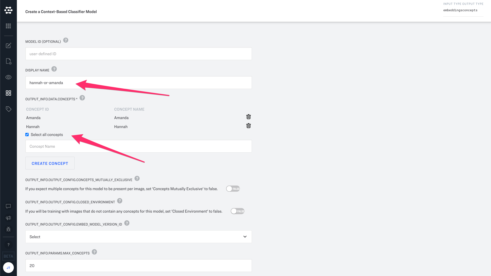
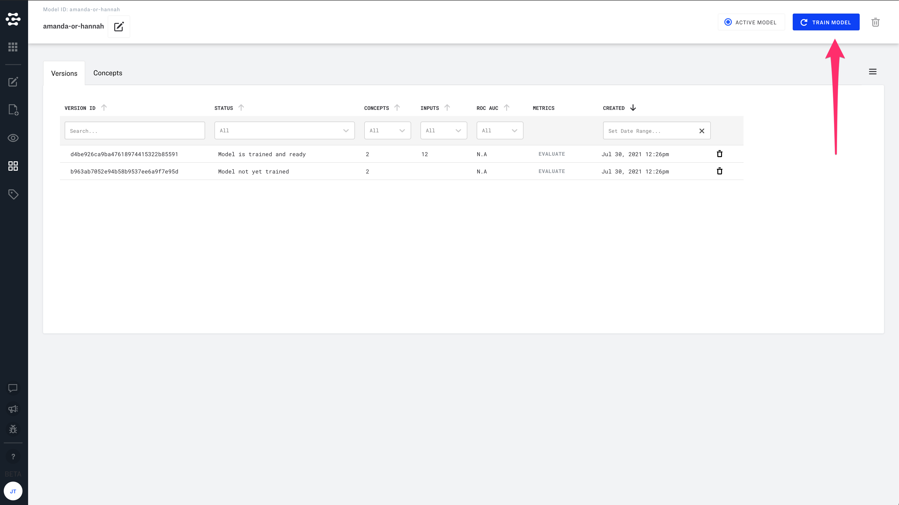
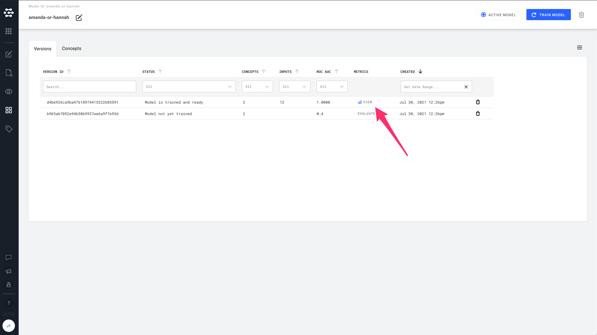
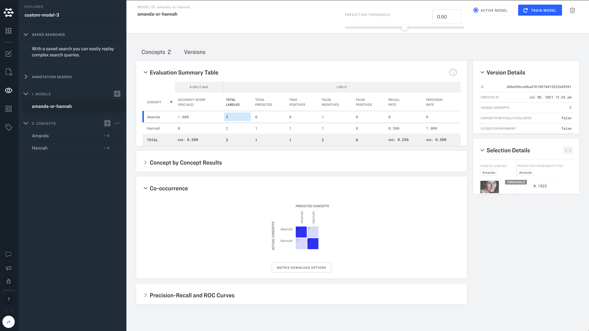

# Your First AI Predictions (~1 min)

When we talk about artificial intelligence, we are generally talking about computer systems that can make predictions. What is being predicted you ask? Predictions usually include at least two parts:

Model output(s)

* Some kind if accuracy score (sometimes this part is hidden under the hood)
* Why is this considered "intelligence"? Your model is offering you ideas, and telling you which ideas it is most confident about.

This turns out to be a very useful way to do computing, and due to the diligent work of our engineers and research scientists, Clarifai models can deliver predictions in the form of many different types of model outputs. Let's start with the the most common prediction: "concepts".

## Step 1: Set up your account or login
Just click here if you need to set up your account for the first time. Or click here to login.‌

## Step 2: Verify your email address
Check your email. We will send you a link that enables you to automatically verify your email.‌

## Step 3: Click "my-first-application"

## Step 4: Upload an image
In Clarifai Portal, you can upload images, videos and text in "Data Mode". Click "Add Inputs", or visit Data Mode by clicking the icon on the lefthand side of the screen.‌

In this example, we are using the "General" model which comes pre-loaded in "my-first-application". The General model is designed to work with images and videos. Click "Browse Files" and upload one or more of your own images.‌

You will be prompted to Add or Assign Concepts. Let's skip this step for now.

## Step 5: Create custom concepts
Click the "Create a Concept" button on the lefthand side of the screen.

Enter the name of a person in your images. You  can repeat this part of the process multiple times to add multiple names.

Use visual search to sort your images based on the person that you would like to recognize.

Select images of the person that you would like your app to recognize.

## Step 6: Create and train your custom model
Click on the model mode icon in the lefthand sidebar.

Click the "Create Custom Model" button in the upper righthand part of the screen.

Select "Context-Based Classifier"

Give your model a display name, click "Select all concepts", then click "Create Model". You can leave the default settings for this example.

Click "Train Model" in the upper righthand corner of the screen. A popup will notify your when your model has successfully been trained.

Click "Evaluate" and then "View".

Take a look at the evaluation metrics for your new model! You can now use the model to predict all of the concepts in your model (in this case the concepts are people's names.

