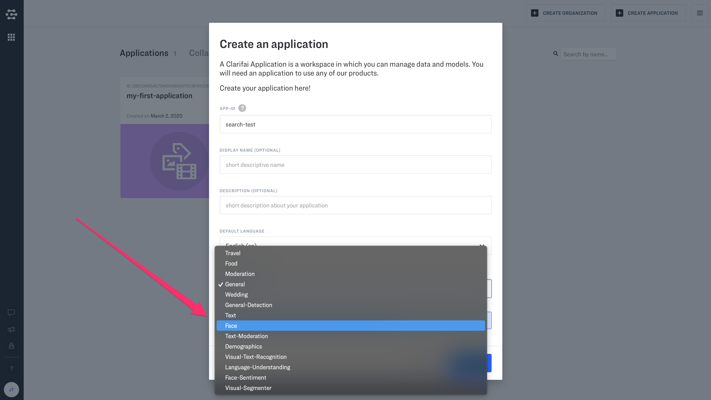

# Your First Visual Search App (~1 min)

Visual search is a versatile and useful tool when you are working with visual data. Visual search helps you compare images based on their visual similarity.

## Step 1: Set up your account or login
Just click here if you need to set up your account for the first time. Or click here to login.‌

## Step 2: Verify your email address
Check your email. We will send you a link that enables you to automatically verify your email.‌

## Step 3: Create an application
Click "Create Application" in the upper righthand corner of the screen.

Name your application, and select "Face" as the base model.

## Step 4: Upload sample images image
In Clarifai Portal, you can upload images, videos and text in "Data Mode". Click "Add Inputs", or visit Data Mode by clicking the icon on the lefthand side of the screen.‌

Browse your files and select several images of people's faces.

You will be prompted to Add or Assign Concepts. Let's skip this step for now.

## Step 5: Search for similar faces
Once images are uploaded, click the "Eye" icon on the lefthand side of the scree to return to Explorer. Now just click on the spyglass icon next to any image.

Clarifai will sort your images by visual similarity. In this example, we can see that they top ranking results are images of the same person.

​
