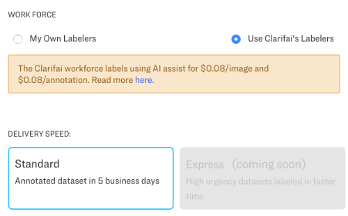

# Data Labeling Services

You don't need to hire, train and manage your own labeling team. With Clarifai's Data Labeling Services you can start your project right away and have the work taken care of by Clarifai's dedicated team of expert labelers. This service is available to Essential and Professional Plan customers.

## How to get started

* Create a new app or start with an existing project.
* Go to the [Data](../portal-guide/data/) tab on the lefthand side of the screen and upload your inputs.
* Go to the Labeler tab on the lefthand side of the screen and click Create New Task.

## Task Name and Instructions

Provide your task with a descriptive name and provide instructions for your labelers. You can even provide you labelers with a "visual dictionary" by including sample image URLs.

## Task Type

Choose the type of label that you would like your worker to add to your images or video. You can choose classification, bounding box detection, polygon detection label types.

Please note that if you want to create a detection labeling task, you will need to select a detection model as the base workflow in your app.

## Input Source

You can choose "All inputs", which will include all inputs from your dataset, or you can choose any one of your [Saved Searches](../portal-guide/psearch/psaved_searches.md).

By saving your searches, you can slice and dice your dataset, and configure dynamic and static types of datasets. You can also create highly customized filters to your data, by adding metadata and searching by metadata filtering.

## Applicable Concepts

[Concepts](data-labeling-services.md) are the words that you are labeling your data with. Concepts can be anything you can think of, and can be written in the language of your choice. You can create concepts in Portal, or you can create them when assigning tasks. Check the "Select all concepts" box to automatically add all available concepts to your app.

## Work Force

Here just click on "Use Clarifai's Labelers", choose your "Delivery Speed" and click "Place Order".

