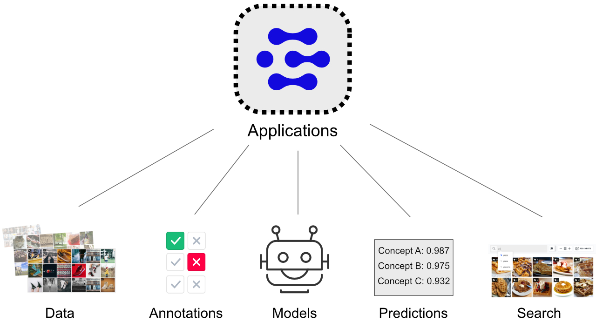

# Applications

Your data, annotations, models, predictions and searches are contained within applications. You can create as many applications as you want and can edit or delete them as you see fit. You can think of applications as projects. They are a collection of resources and provide control over the permissions to those resources.

Each individual application is associated with App-Specific API Key. API keys are one of the ways that you can authenticate your application. You can learn more about authentication in the next section.

