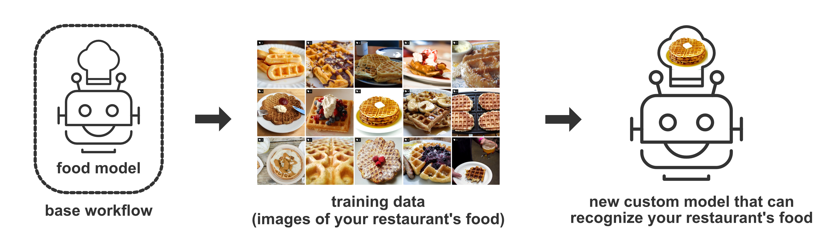

# Base Workflows

Our platform is designed to make the process of creating custom machine learning applications quick and simple, with minimal training data required. One of the ways that we make this possible is through a sophisticated transfer learning architecture that gives your app a "head start" when it comes to indexing and classifying your data.

When you create a new app, you choose a base workflow that will provide the transfer learning framework for your app. Each base workflow contains one Clarifai Model, and the Clarifai Model that you choose will determine the type of "head start" that you are giving your application.

For example, if you're training a custom model to recognize your restaurant's dishes on social media, you would choose the 'Food' model in your base workflow.

You currently have the option of using our General, Travel, Food, Face, Moderation, and Wedding models in your base workflow. More information on these, and other Clarifai Models can be found in our [model gallery](https://www.clarifai.com/models). You can learn more about workflows [here](https://docs.clarifai.com/api-guide/workflows).


We recommend choosing the 'General' model if you're not sure which Clarifai Model would best suit your use case.

