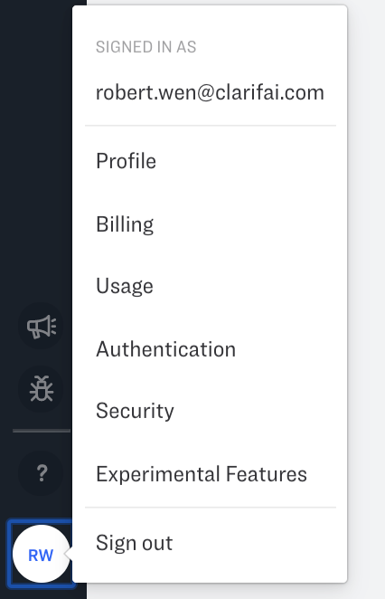

# Two Factor Authentication (2FA)

Two-factor authentication is an optional sign-in security feature that provides an additional layer of security for your account.

## Why 2FA?

Passwords have been the main form of authentication since the start of the digital revolution. However, this security measure is far from infallible. Here are some concerns about the password-based authentication:

* 90% of passwords can be cracked in less than six hours.
* 2/3 of people use the same password everywhere.
* Sophisticated cyber attackers have the power to test billions of passwords every second.
* The vulnerability of passwords is the main reason for requiring and using 2FA.

### Who needs 2FA?

As a security best-practice, you should enable 2FA to minimize the risk of cybersecurity attack on your account. Despite the interruption at the sign-in process, the additional security benefit is significant.

For enterprise users, 2FA might fall under the security-related controls for compliance reasons. Organizations might want to enforce 2FA for their users to ensure account and data safety.

### How does 2FA work on the Clarifai Platform

Two-factor Authentication (2FA) works together with the sign-in process. 2FA will ask you to provide a code at sign-in.  It works as the extra layer of security after basic authentication. It affects the user flow of Sign-in when the 2FA is enabled. The 2FA recovery is added into the sign-in process when the 2FA device is lost. Also, 2FA setup and disable are added into the user security settings.

You are able to enable and disable the 2FA for the sign-in process. Also, you are able to recover the 2FA if you lose the 2FA authenticator.

## 2FA Setup

To enable the 2FA, you have to sign-in to the platform first. Once you sign into the platform, you can go to Security settings page.

On the Security page, user can toggle the “Enable” to setup the 2FA.

Once the enable is toggled:

### 2FA Sign-In
When you sign in to the Clarifai platform with correct username and password, 2FA kicks in.

A box will show up on the screen asking for the authentication code.

If the correct code is entered, you will be taken to Portal.

### 2FA Disable
To disable the 2FA, go to the Security page.

Click the toggle, you will be prompted to enter the code from the authenticator application.

Once entered with the correct code, 2FA will be successfully disabled.

## 2FA Recovery

### Self-serve

If the authentication app is somehow lost, you will not be able to sign in with 2FA.

In order to recover access to the Clarifai platform, you need to go through the recovery process.

Go to the sign-in page https://portal.clarifai.com/login

Enter the correct username and password.

With the prompt of the 2FA code, click “Enter a recovery code” link.

A box below will be prompted asking for recovery code.

After entering the recovery code and click “VERIFY”, an email will be sent to the account email address to confirm the TOTP reset.

Click the link, a page to the Clarifai portal will be opened. Your 2FA will be confirmed to be reset from there.

### Last-resort

If you lose the recovery code, there is no self-serve way to recover access to the Clarifai platform. You will have to reach out to support@clarifai.com to recover access.

