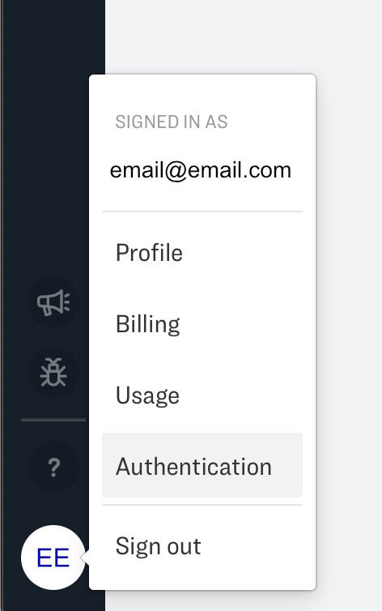
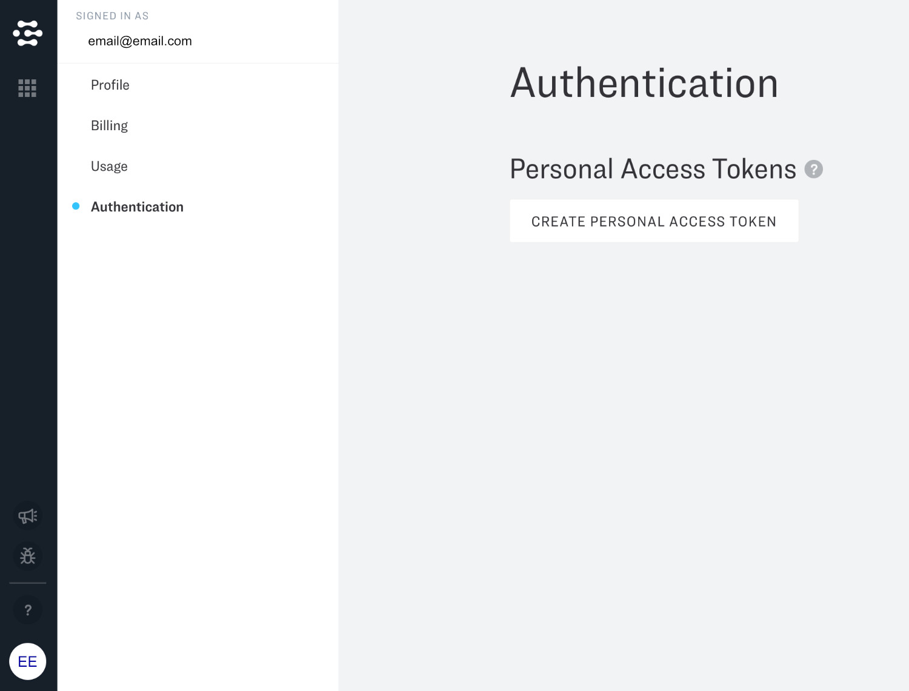
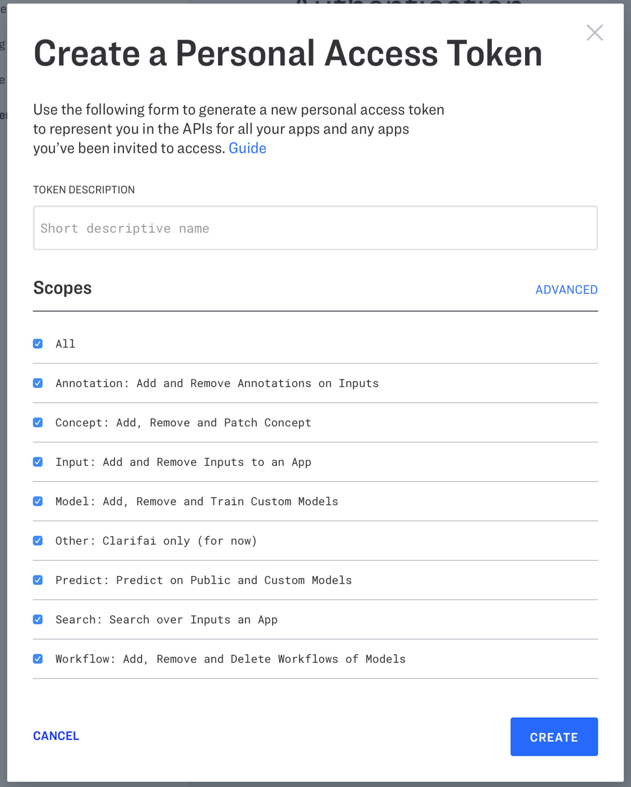

# Personal Access Tokens

Personal Access Tokens (PAT here for short) represent a specific user when accessing the Clarifai API. They are more flexible than API keys because they can be used across multiple apps based on the applications a user has been granted access too. Personal Access Tokens allow a user to access their own apps and any apps where they have been added as collaborators.

To create a new PAT, navigate to the bottom left hand corner of the application overview page and click on your initials:

Select authentication:

And click on "Create a Personal Access Token"

