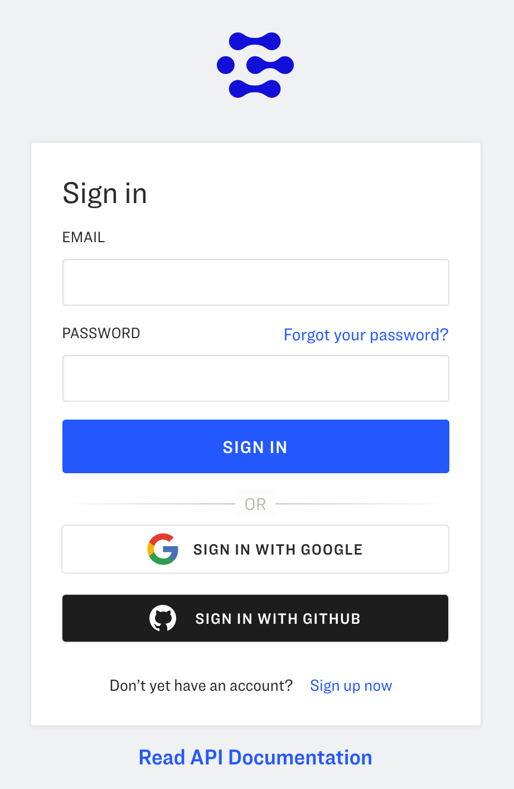
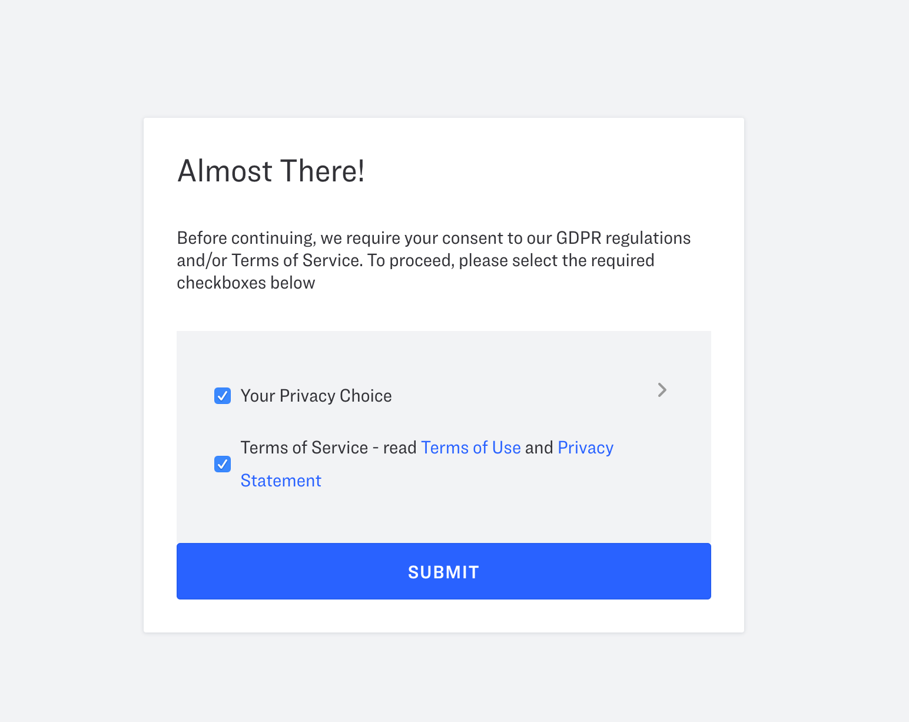
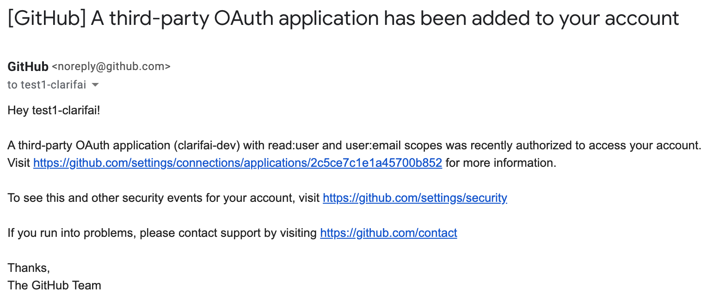
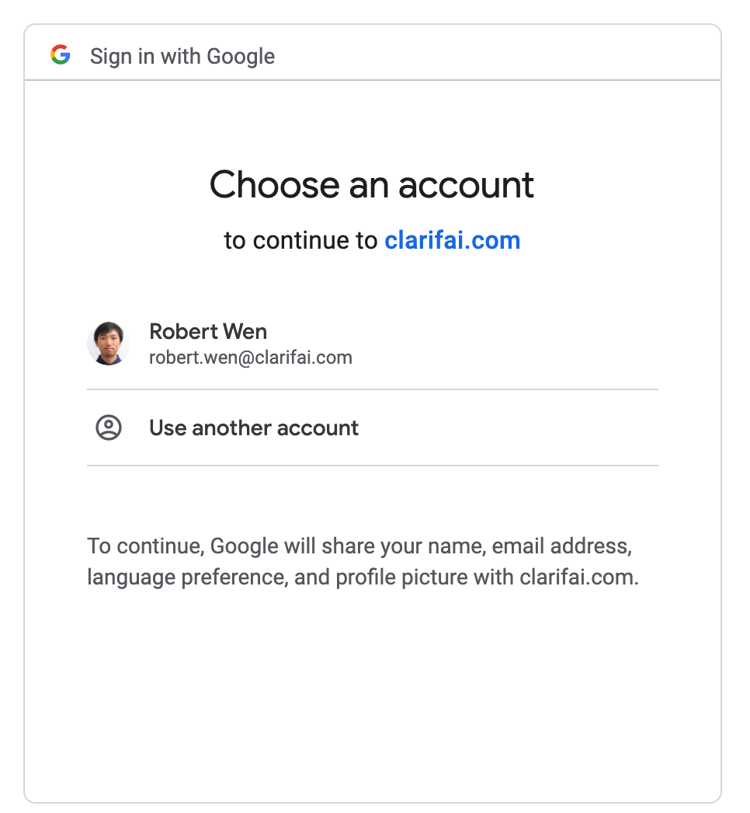

# Using Social SSO (Single Sign On) with Clarifai

Social SSO Login is a simple and convenient way to access Clarifai with login credentials that already exist on other social platforms. Clarifai users  can currently login with their Google or GitHub accounts. No need to fill out the sign-up forms or remember another password.

## How to use SSO?

### GitHub
1. Click the “Sign in with GitHub” button and you will be redirected to the Authorization page:

2. Once you press Authorize Clarifai, your account will be created with your GitHub account. You will be then asked to consent to the [GDPR-Privacy-Policy](https://www.clarifai.com/privacy-policy) as shown below.

3. Congratulations. You are now a Clarifai User.

#### How to revoke the permission via GitHub.

Once you have authorized the account via GitHub, you will get an email that looks like the screenshot below.

You can click the Revoke Access button to disconnect your Clarifai and GitHub account.

If you click the link in the email, you can click it and revoke access to Clarifai through your GitHub account.

### Google

1. Click the “Sign in with Google" button and you will be redirected to the Authorization page:

2. Choose the account to use for creating your Clarifai Account.

3. Consent to the [GDPR-Privacy-Policy](https://www.clarifai.com/privacy-policy) as shown below.

