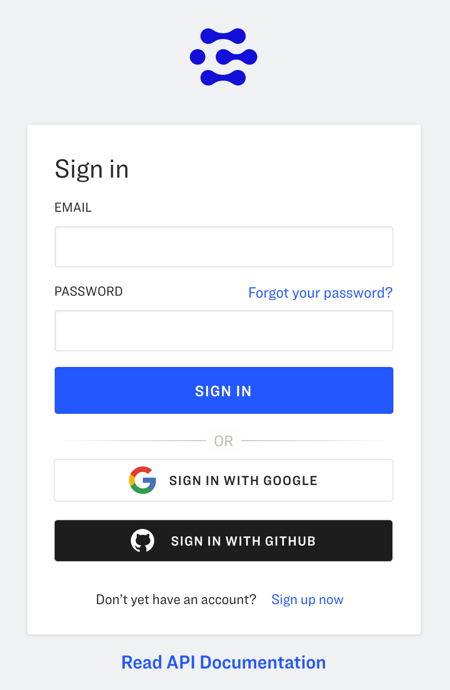

# Using Social SSO (Single Sign On) with Clarifai

## What is Social SSO?

In general, Single Sign On (SSO) allows the clients to manage the users outside of the built-in application. 

Similar to Single Sign On (SSO), Social Login allows users to access systems with login credentials that already exist on other social platforms. It’s simple and convenient and it will let Clarifai users utilize social logins for Google and GitHub. These social Sign On were used primarily because it enhances the user experience of Open Social - no need to fill out the sign-up forms or remember another password. 

## Why do we need it?

There are a few benefits using Social SSO for Sign In.

**Increase user sign-ups.** The ease of use of social login significantly reduces the barrier to entry. Joining the platform becomes simply a click of a button, rather than the work of filling out a form.

**Accurate data.** It allows Clarifai to get more accurate data and improves the identification of the platform users for enhancing user experience. 

**Increased security.** Popular social platforms like Google and GitHub have a more robust layer of protection than most other IT companies. 

## Why Google and GitHub? 

Nowadays almost everyone has one or more Google account(s). This universal availability of Google accounts makes it easier for users to create a Clarifai account by using their Google account as a Single Sign On. To accomodate the developers who use Clarifai's account, GitHub was incorporated into our Single Sign On options. 

## How to use it?

Using Google/GitHub to sign-up for a Clarifai account is very simple as shown in the below screenshots.

### GitHub
After clicking the “Sign in with GitHub” button user will be redirected to the Authorisation page:

If he presses Authorize Clarifai green button he will be directed back to portal, where he will be logged in. If he did not have an account before it will be created and he has to accept the privacy policy and terms:

After Authorising their account with GitHub the user will be sent an email by GitHub that looks something like this:

The link in the email will take user to his/her security page, where he/she can Revoke access to our application. This means that when they want to sign in a gain with GitHub to the Portal they have to authorise again.

Google

