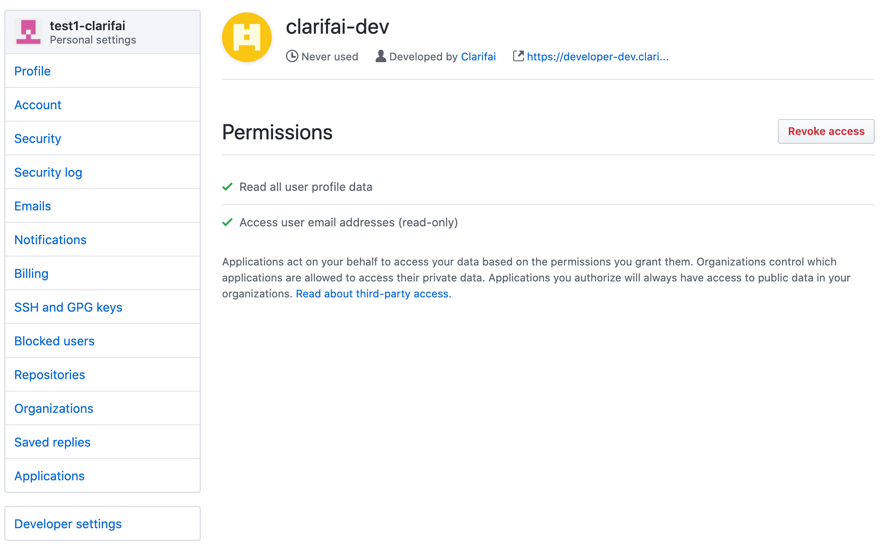

# Using Social SSO (Single Sign On) with Clarifai

## What is Social SSO?

In general, Single Sign On (SSO) allows the clients to manage the users outside of the built-in application. 

Similar to Single Sign On (SSO), Social Login allows users to access systems with login credentials that already exist on other social platforms. It’s simple and convenient and it will let Clarifai users utilize social logins for Google and GitHub. These social Sign On were used primarily because it enhances the user experience of Open Social - no need to fill out the sign-up forms or remember another password. 

## Why do we need it?

There are a few benefits using Social SSO for Sign In.

**Increase user sign-ups.** The ease of use of social login significantly reduces the barrier to entry. Joining the platform becomes simply a click of a button, rather than the work of filling out a form.

**Accurate data.** It allows Clarifai to get more accurate data and improves the identification of the platform users for enhancing user experience. 

**Increased security.** Popular social platforms like Google and GitHub have a more robust layer of protection than most other IT companies. 

## Why Google and GitHub? 

Nowadays almost everyone has one or more Google account(s). This universal availability of Google accounts makes it easier for users to create a Clarifai account by using their Google account as a Single Sign On. To accomodate the developers who use Clarifai's account, GitHub was incorporated into our Single Sign On options. 

## How to use it?

Using Google/GitHub to sign-up for a Clarifai account is very simple as shown in the below screenshots.

## GitHub
1. Click the “Sign in with GitHub” button users will be redirected to the Authorisation page:

2. Once you press Authorize Clarifai, your account will be created with the user's GitHub account. You will be then asked to consent to the [GDPR-Privacy-Policy](https://www.clarifai.com/privacy-policy) as shown below.

3. Congrats. You are now a Clarifai User.

## How to revoke the permission via GitHub.

Once you have authorized the account via GitHub, you will get an email that looks like the screenshot below.

You can click the Revoke Access button to disconnect your Clarifai and GitHub account. 

If you click the link in the email, you can click it and revoke access to Clarifai through your GitHub account. 

## Google

1. Click the “Sign in with Google button users will be redirected to the Authorisation page:

2. Choose the account to use for creating your Clarifai Account. 

3. Consent to the [GDPR-Privacy-Policy](https://www.clarifai.com/privacy-policy) as shown below.

