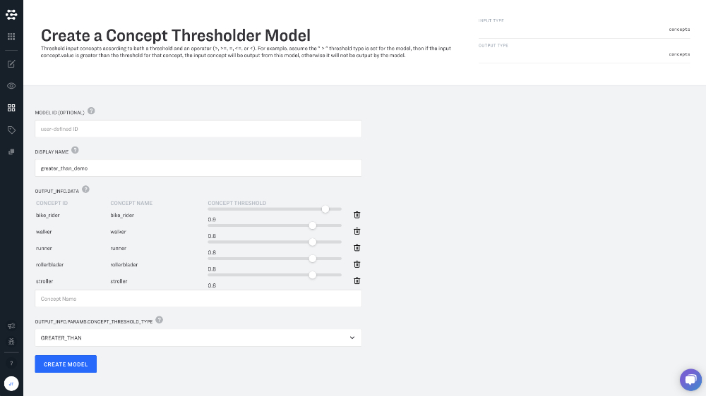

# Auto Annotation

This tutorial demonstrates how auto-annotation workflows can be configured within Clarifai Portal. With auto-annotation, you can use model predictions to label your inputs. Auto-annotation can help you to prepare training data, or assign other useful labels and metadata to your inputs.

When a concept is predicted by a model, it is predicted with a confidence score between 0 and 1. When your model predictions are confident \(close to 1\), you can have your data automatically labeled with that concept. When your predictions are less-than-confident, you can have your input sent to a human being for review.

This enables you to speed-up and scale-up your annotation process while ensuring quality standards.

## Create Concepts, Label and Train a Custom Model

To begin, create your application and upload your inputs.

Upload files from your computer, or add image and video URLs.

Create the concepts that you would like to use for your model. Click create new concept in the lefthand sidebar. In this tutorial we'll create concepts that describe people based on activities they do in the park: `walker`, `runner`, `bike_rider`, `rollerblader` and `stroller`.

Label your inputs with the appropriate concepts by clicking the checkmark box.

## Navigate to the Model Gallery

Now it is time to create some custom models.

## Create a Context-Based Classifier

A Context-Based Classifier lets you create a custom classification model that will predict the concepts you have created. Choose a `DISPLAY NAME` and click in the `OUTPUT_INFO.DATA.CONCEPTS` box to select the concepts that you would like included in your model. Finally, click "Create Model" and then click "Train Model" in the next page.

## Create `GREATER THAN` and `LESS THAN` Concept Thresholder models

Concept Thresholders help you route your data based on the confidence of your predictions. Choose a `DISPLAY NAME` and add the concepts you would like to route under the `OUTPUT_INFO.DATA` heading. You can choose separate concept thresholds for each of your custom concepts. Create one model with high `CONCEPT THRESHOLDS` and select `GREATER_THAN` under `OUTPUT_INFO.PARAMS.CONCEPT_THRESHOLD_TYPE`. Create a second Concept Thresholder model with low `CONCEPT THRESHOLDS` and select `LESS_THAN` under `OUTPUT_INFO.PARAMS.CONCEPT_THRESHOLD_TYPE`. The `LESS_THAN` model will help you screen out concepts that are predicted with very low confidence.

## Create a `WRITE SUCCESS` and `WRITE PENDING` Annotation Writer models

The Annotation Writer writes each annotation with a specific concept, status and user. Create one Annotation Writer that will write the annotation with the `ANNOTATION_SUCCESS` status and choose the user \(possibly yourself\) under `OUTPUT_INFO.PARAMS.ANNOTATION_USER_ID`. Create a second Annotation Writer that will write with the `ANNOTATION_PENDING` status.

## Create the workflow

We will now join all the models together into a single workflow. In the Clarifai platform, the outputs from one model can be used as inputs to another model. Different models accept and produce different types of inputs and outputs.

The Context-Based Classifier will return list of concepts for each of your inputs. These inputs will then be sent to the Concept Thresholder models. `GREATER THAN` model will filter out the concept if it lower than the threshold and send the final concept list to `WRITE SUCCESS` model. Concepts will then be written to the input with `SUCCESS` status. You can train or search on these concepts immediately.

The `LESS THAN` model will filter out the concepts with low prediction scores. The remaining concept list will be sent to `WRITE PENDING`. Concepts will then be written to the input with `PENDING` status.

## Make the new workflow your app's default

Make this the default workflow in the app, so it will run every time we add an input and execute the auto annotation process. If the workflow is not the default workflow of your app you can still use PostWorkflowResults on new inputs to check that you configured the workflow graph and your models properly but the data will not be written to the DB. This is recommended before making it your default workflow and adding inputs to you app.

## Add new images

Adding new images will trigger the default workflow in your app.

## View Annotations in Explorer

Now you can view your annotations in Explorer. Just drag your mouse over the "tag" icon to see annotations associated with the image.

