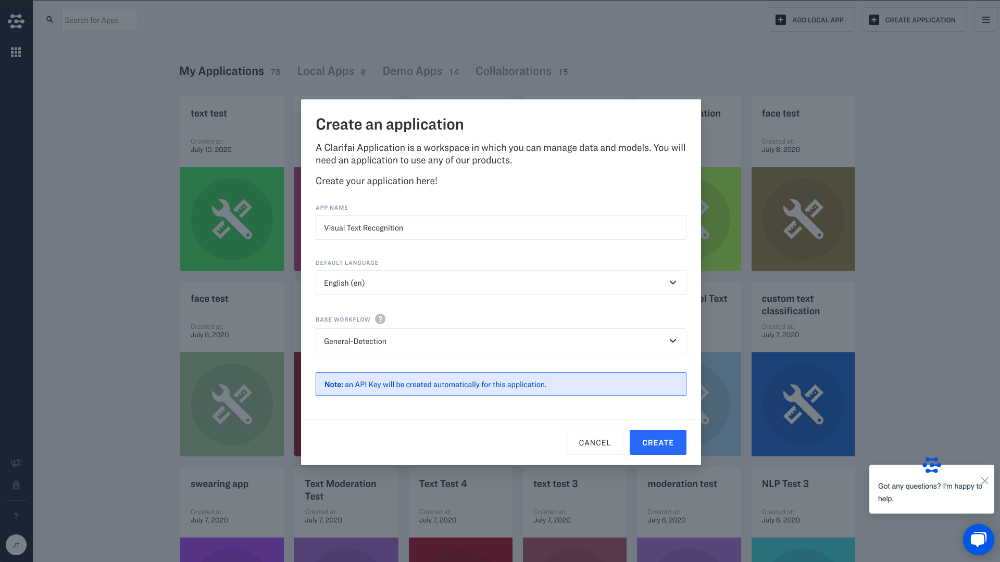
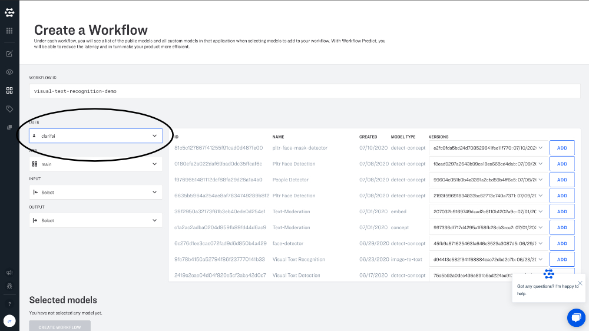
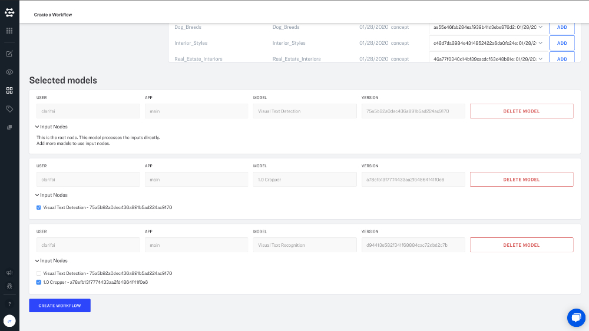
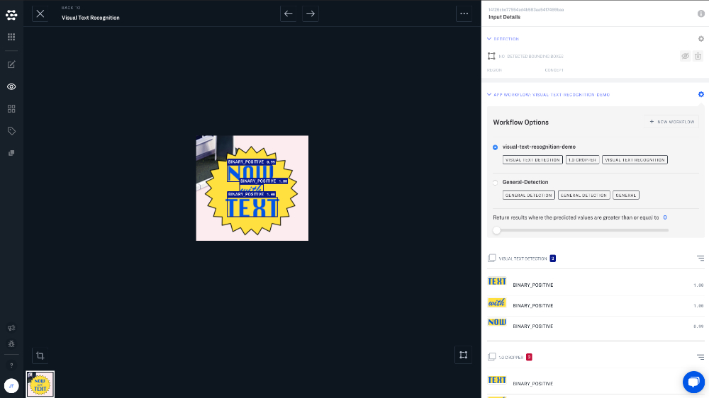

# Visual Text Recognition

Visual text recognition helps you convert printed text in images and videos into machine-encoded text. You can input a scanned document, a photo of a document, a scene-photo \(such as the text on signs and billboards\), or text superimposed on an image \(such as in a meme\) and output the words and individual characters present in the images. VTR lets you "digitize" text so that it can be edited, searched, stored, displayed and analyzed.


Please note: The current version of our VTR model is not designed for use with handwritten text, or documents with tightly-packed text \(like you might see on the page of a novel, for example\).


## How VTR works

VTR works by first detecting the location of text in your photos or video frames, then cropping the region where the text is present, and then finally running a specialized classification model that will extract text from the cropped image. To accomplish these different tasks, you will need to configure a workflow. You will then add these three models to your workflow:

* **Visual Text Detection**
* **1.0 Cropper**
* **Visual Text Recognition**

Start by creating an app with General-Detection as the base workflow.

Next, navigate to Model Mode and click "Create Workflow".

Under "User" select Clarifai to access Clarifai Models.

Add these three models to your workflow:

* **Visual Text Detection**
* **1.0 Cropper**
* **Visual Text Recognition**

Connect the input nodes in your workflow.

* Connect "1.0 Cropper" to "Visual Text Detector".
* Connect "Visual Text Recognition" to "1.0 Cropper".

Upload your inputs and navigate to Explorer view. On the righthand sidebar click the "gear" icon under app workflow. Select your newly created workflow and view your detected text.

