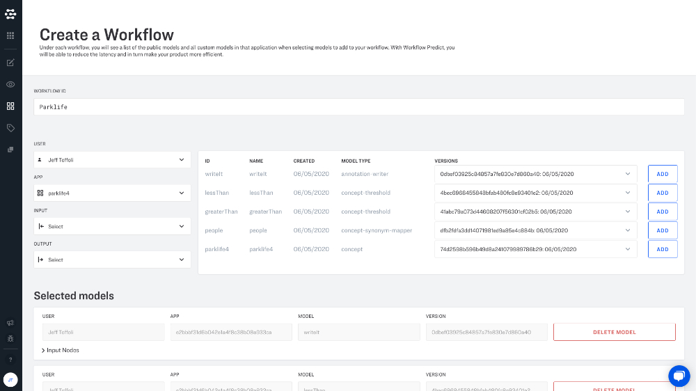

# Welcome

## Get started with a few clicks, or a few lines of code.

Clarifai offers you two powerful ways to integrate AI within your technology stack.

[ **Clarifai API**](api-guide/api-overview/) - Our code-based interface designed for integration within your software applications. Our API offers clients in many popular programming languages.

[ **Clarifai Portal**](https://github.com/Clarifai/docs/tree/b4d75d8274dc9af9b2cfc5c92933e4431f9bfcef/portal-guide/portal_overview/README.md) - Our custom user interface \(UI\) designed specifically for your AI projects. Portal makes it fast and easy to label data, build and train models, and connect these models into workflows.

## Create and organize your AI projects

### Applications

Applications are the basic containers for your AI projects. You can create as many applications as you want, and applications can be duplicated or shared with collaborators.

[ Applications API](getting-started/applications/) / [ Applications in Portal](getting-started/applications/)

### Annotate

Annotations \(sometimes called "labels"\) are how we "teach" machines to learn new ideas. When you want to create a custom model for your business, you do this by training this model to recognize the concepts that you have annotated on your training data.

[ Annotation API](api-guide/annotate/) / [ Annotation with Portal](portal-guide/annotate/)

### Model

Models are where the "thinking" happens in your AI application. Clarifai supports a variety of different [types of models](https://docs.clarifai.com/portal-guide/model/model-types.md), including "machine learning" models that can learn new things from your training data and fixed-function model operators that help you control the way that your models interact.

[ Model API](api-guide/model/) / [ Model with Portal](portal-guide/model/)

### Workflows

Workflows allow you to link multiple models together so that you can build complex and creative solutions. Clarifai models are designed so that the outputs from one model can be used as the inputs in another model.

[ Workflows API](api-guide/workflows/) / [ Workflows with Portal](portal-guide/workflows/)

### Predict

Predictions are the basic "output" of machine learning models. Predictions are returned as a list of concepts with corresponding probabilities that tell you how confident your model is with a given prediction.

[ Predict API](api-guide/predict/) / [ Predict with Portal](https://github.com/Clarifai/docs/tree/b4d75d8274dc9af9b2cfc5c92933e4431f9bfcef/portal-guide/ppredict/README.md)

### Search

Clarifai's patented technology automatically indexes your media for search. Concepts in your models can be used as search terms. You can also search with images to find similar images. We offer numerous search types that can be combined to filter and sort your data.

[ Search API](api-guide/predict/) / [ Search with Portal](portal-guide/psearch/)

