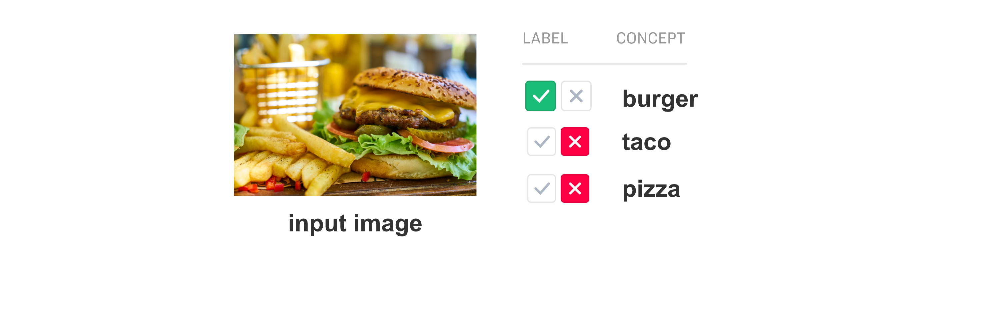

# Annotate

Annotations \(sometimes called "labels"\) are how we "teach" machines to recognize concepts. When you want to create a custom model for your business, you do this by training this model to recognize the concepts that you have annotated on your sample data.


Annotations are similar to predictions, in that both are concerned with the concepts that your model can recognize. There is one important distinction to keep in mind: People make annotations about concepts Models make predictions about concepts



For step-by-step guides, visit Portal [Walkthroughs](../walkthroughs).

