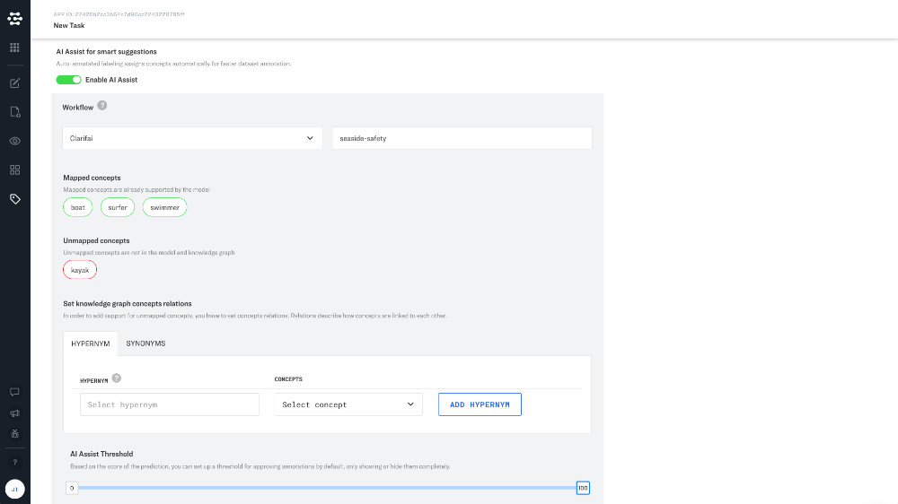
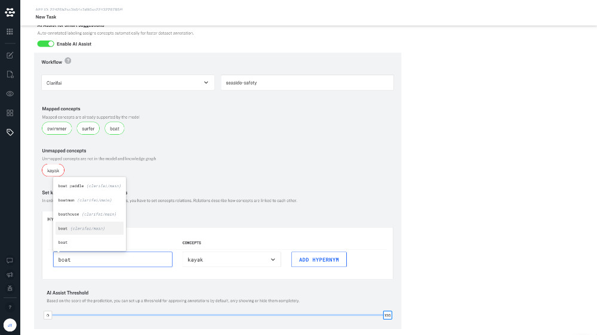
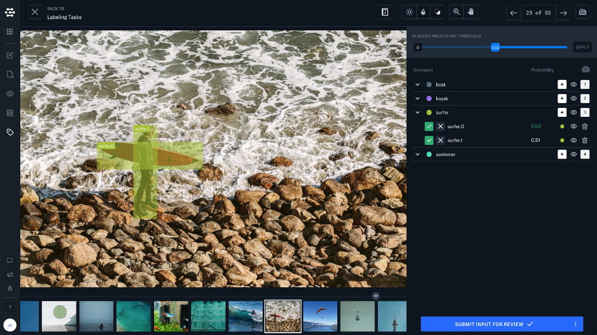

# AI Assist

Speed up your labeling workflows with AI Assist. AI assist assigns concepts automatically for faster dataset annotation.

To activate AI Assist, just create a new labeling task and toggle the "Enable AI Assist" switch at the bottom of the task creation screen. Now you will need to choose a workflow to power your AI predictions. AI Assist supports custom models as well as Clarifai models.

## Custom Workflow

By selecting a custom workflow AI Assist will offer predictions made by your custom model.

## Clarifai Workflow

By choosing a Clarfai workflow, AI Assist will make predictions based on one of Clarifai's Public Models. AI Assist will automatically recognize concepts in your application that map to existing Clarifai concepts. You will see these concepts outlined in green in the "Mapped concepts" section.

Custom concepts that are not recognized by Clarifai models will be outlined in red under the "Unmapped concepts" section.

You can map one of your custom concepts to a concept recognized by a Clarifai model in the "Set knowledge graph concept relations" section.

### Hypernym

If you want to map a "general" concept recognized by a Clarifai model to a more specific concept in your application, choose the hypernym option.

### Synonym

If you want to map a custom concept to a similar Clarifai concept, choose the synonym tab.

Scribe will automatically recommend possible matching Clarifai concepts.

## Review

Once a task is created your labelers can review and label your inputs. Labels will automatically be added to your inputs based on the "AI Assist Prediction Threshold". If the probability score is highlighted in green the label will be added to the input when you click "Submit input for review".

Labelers can also add, remove, or change their own labels.
