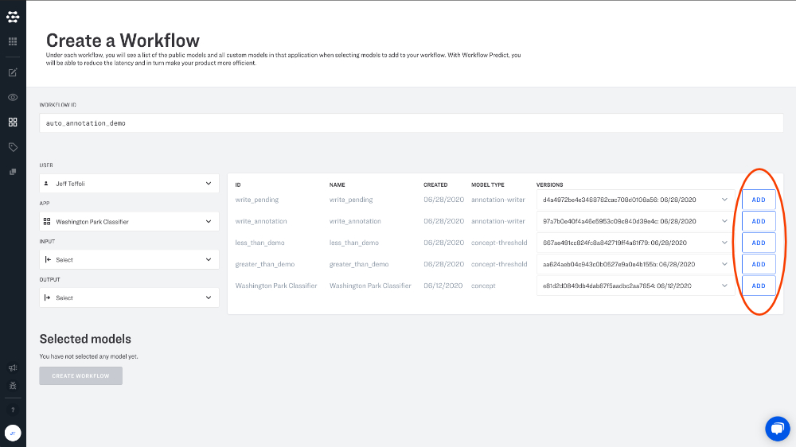

# Auto Annotation Walkthrough

This tutorial demonstrates how auto-annotation workflows can be configured in the Clarifai API. Inputs are automatically annotated with concepts and assigned `SUCCESS` status by leveraging the high confidence predictions of a model, and when the model is unsure, the annotation is going to be written as you with `PENDING` status. This enables you to scale up your annotation process while ensuring quality standards by including a backstop of human reveiw.

### Create Concepts, Label and Train a Custom Model

Create the concepts that we'll be using in our model. In this tutorial we'll create the following concepts: `people`, `man` and `adult`.

### Create a "greater than" Concept Thresholder model

### Create a "less than" Concept Thresholder model

### Create a "write success as me" Annotation Writer model

### Create the workflow

We will now join all the models together into a single workflow.

Every input will be predicted by General Embed model to generate embedding. The output of the embed model (embeddings) will be sent to general concept to predict concept and cluster model. Then the concept model's output (a list of concepts) will be sent to concept mapper model which maps Clarifai concept to your concept, `people`, `man` and `adult` in this case. Then the mapped concepts will be sent to both concept thresholds models (`GREATER THAN` and `LESS THAN`). `GREATER THAN` model will filter out the concept if it lower than corresponding value you defined in model and send the final concept list to `write success as me` model which labels the input with these concepts (your app concepts only) as you with `success` status. You can train or search on these concepts immediately. The `LESS THAN` model will filter out the concept if it is higher than the corresponding value you defined and send the final concept list to `write pending as me` model which labels the input with these concepts (your app concepts only) as you with `pending` status.

The model IDs and model version IDs from the public `clarifai/main` application are fixed, so they are already hard-coded in the code examples below. It's possible to use other public model or model version IDs.

### Make the new workflow your app's default

Make this the default workflow in the app, so it will run every time we add an input and execute the auto annotation process.

### Add an image

Adding the image will trigger the default workflow.

### List annotations

Now you can list annotations with your user id to see the annotations created by your workflow.

