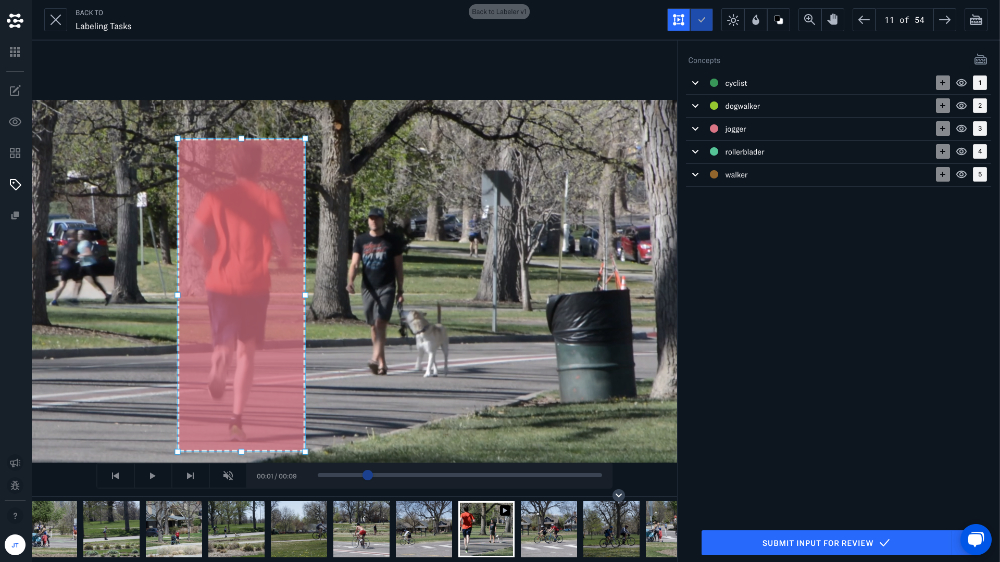
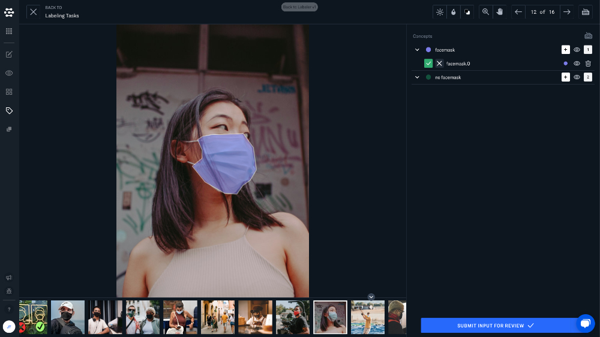

# Label Types

Labeler provides three basic label types for your images and videos. These label types provide increasing levels of granularity to support the needs of your specific use case.

## Classification

Provide annotation for an entire image, or single frame of video. To classify an image just create your concepts, click on the concepts in the right-hand sidebar and click submit.

## Bounding Box Detection

Provide annotation within a single box-shaped region of an image or video. To use bounding box detection, you must start with a workflow that offers detection capabilities. From here you can label detected regions, or draw your own bounding boxes for labeling.

### Detection for Still Images

### Detection for Video

## Polygon Detection

Provide annotation within any polygon-shaped region of an image or video.

