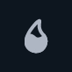
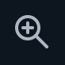
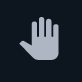
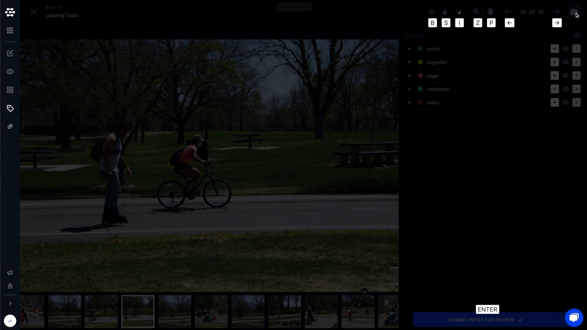
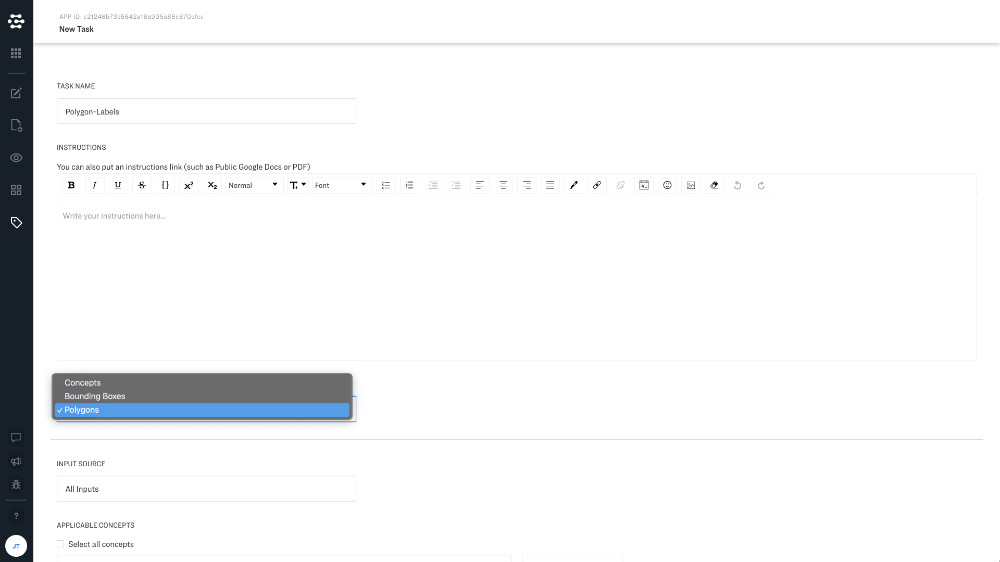
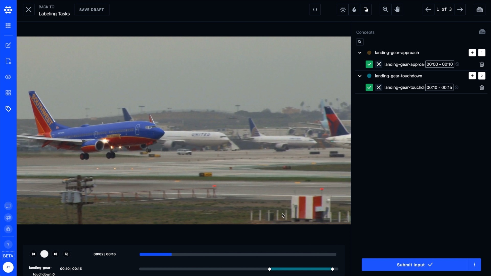
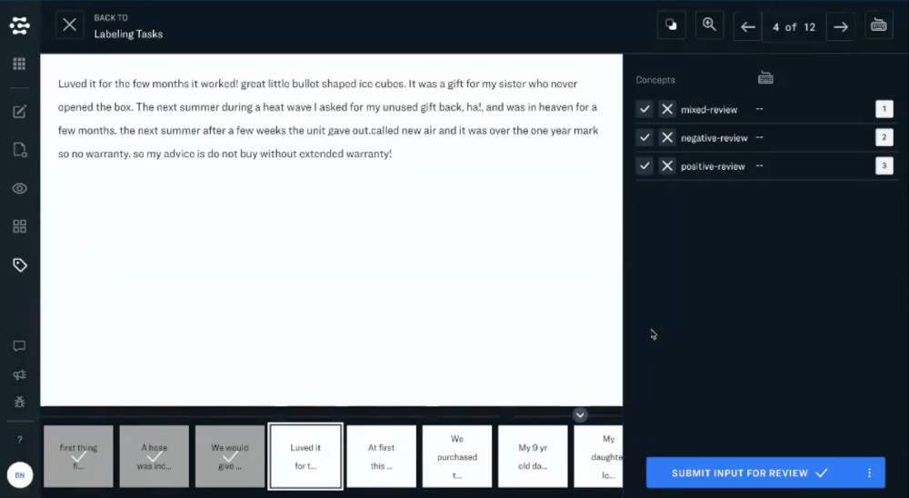

# Labeling Tools



Scribe provides special tools for working with images and video.

## Viewing images

### Brightness, saturation, and color inversion

  

You can enhance the visibility of your photos with image adjustments. You can combine image adjustments. Just click reset to return to the original version of your input.

### Zoom and pan

 

Powerful zoom and panning features allow you to inspect specific regions of an image closely. Just click reset to return to 100% zoom.

## Shortcuts

### General keyboard shortcuts

* Left arrow - Previous input
* Right arrow - Next input
* Enter - Submit label

### Image keyboard shortcuts

* B - Brightness
* S - Saturation
* I - Inversion

## Editing labels

You can easily resize, move, or relabel existing bounding boxes. Just click on the bounding box that you would like to change and drag to move or resize. You can relabel bounding boxes by clicking the "edit" icon next to the existing label in the right-hand sidebar.

## Bounding Box and Polygon Labeling

You can handle many labeling tasks well with bounding box labels, but in cases where you need a more precise way to annotate objects. Polygon labels allow you to identify and annotate the exact pixels of your image that represent the object you would like to label. Polygon labels will output a sequence of x, y coordinates for every point that comprises the polygon.

First, you will need to select "Polygons" as the task type when creating your labeling task.

When labeling your images, you can create multi-point shapes that can outline the pixels of the object you would like to label. Remember that you will need to "connect the dots" by connecting the last point in your polygon with the first point.

## Quick-Mask Tool

The quick mask tool makes it easy to select image masks when creating polygon annotations. Just be sure to choose the "Polygon" Task Type when creating your labeling task. The Quick-mask tool allows you to select a region of an image and then automatically generate an images mask for the detected object in the image. You can also fine-tune the selection once a mask has been created.

## Video

Scribe provides powerful tools for labeling videos. When working with video, you can leverage video interpolation tools to label thousands of individual frames of video quickly. This rapid labeling technique makes video an excellent source of training data, even if you want your model to primarily analyze still images. You can use QuickTrain and DeepTrain models on video data that has been labeled in Scribe.

### Keyframes

Keyframes define the starting and ending points of interpolated transitions. When you adjust the positions of bounding points around your object, new keyframe markers are added to the timeline of your video. Keyframes allow you to adjust for the changing shape, speed, and trajectory of a given object in your video.

### Frames and time segments

When labeling video, you can label and train video at the frame level or the video level. Labeling video at the frame level means that you are labeling individual video frames as separate images. Labeling video at the video level means that you are labeling an entire video or a segment of time from a video.

When creating your labeling project, you can label a video using time segments by selecting a concept task type. Just click the plus icon in the labeling view, and you can adjust the time segment selected by using the slider bars below the video.

Note that you can label an entire video with a concept by holding down the option key when clicking the plus icon to add a concept to a video. You can also click the cancel button next to the time segment display, and the concept will be applied to the whole video (if you want to remove the entire concept, click the trash can icon instead,

### Interpolation

Interpolation allows you to label multiple frames of video with the same concept quickly. Select the interpolation icon and draw a bounding box or polygon around the object you would like to label. Then scrub the video player to a new point in the video and move and adjust the bounding box to the object's new location. Interpolation will automatically draw a series of bounding boxes between them. A keyframe marker will identify the point in the video where a new interpolation begins.

### Track suggestions for AI-Assist

AI-Assist can automatically track objects across multiple frames of video. Just be sure to include a "centroid-tracker" in the workflow that you are using for AI-assist. Separate instances of a given concept will be detected and versioned for labeling. You can even use the timeline editor to scrub back and forth between different frames of video.

### Video keyboard shortcuts

* Q - Start of video
* W - Scrub backward
* E - Scrub forward
* R - End of video

## Text

Scribe makes it easy to label your text data. You can review text inputs in the same view that you would review images for classification tasks.

