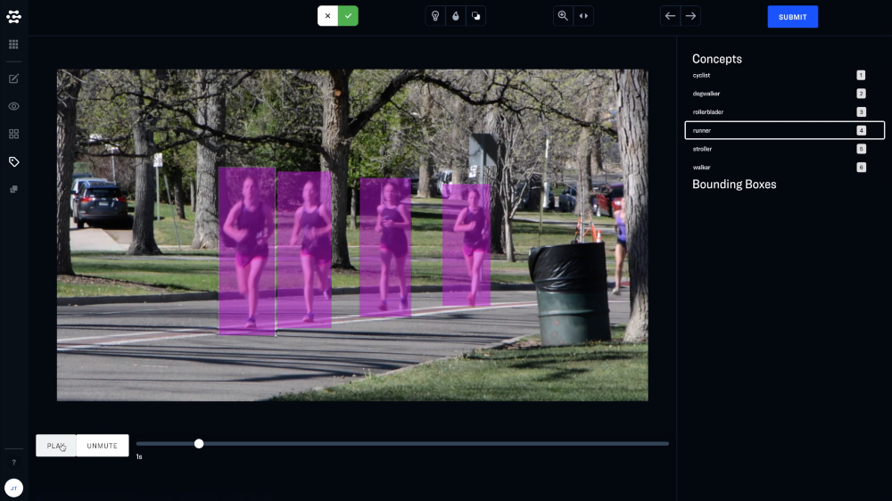

Labeler provides special tools for working with images and video.

## Images

### Brightness, saturation and color inversion

You can enhance the visibility of your photos with image adjustments. Image adjustments can be combined. Just click reset to return to the original version of your input.

### Image Keyboard shortcuts

#### B - Brightness
#### S - Saturation
#### I - Inversion

### Zoom and pan

Powerful zoom and panning features allow you to closely inspect specific regions of an image. Just click reset to return to 100% zoom.

## Video
Labeler enables you to work with detections over time

### Interpolation

Interpolation allows you to quickly label multiple frames of video with the same concept. Simply select the interpolation icon and draw a bounding box around the object that you would like to label. Then scrub the video player to a new point in the video and move and adjust the bounding box to the new location of the object. Interpolation will automatically draw a series of bounding boxes between them. 

### Video Keyboard shortcuts

#### Q - Start of video
#### W - Scrub backward
#### E - Scrub forward
#### R - End of video

### General Keyboard shortcuts

#### Left arrow - Previous input
#### Right arrow - Next input
#### Enter - Submit label
