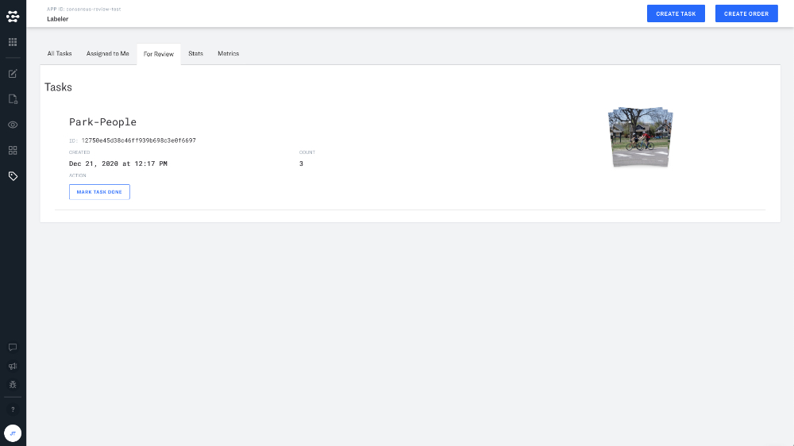
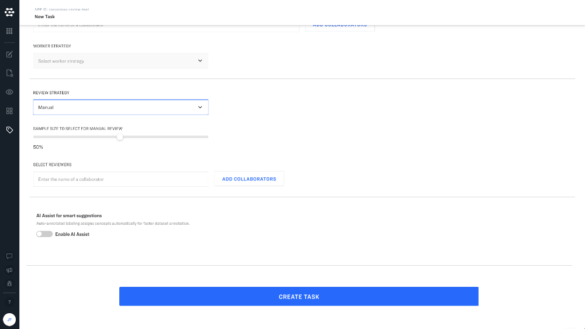
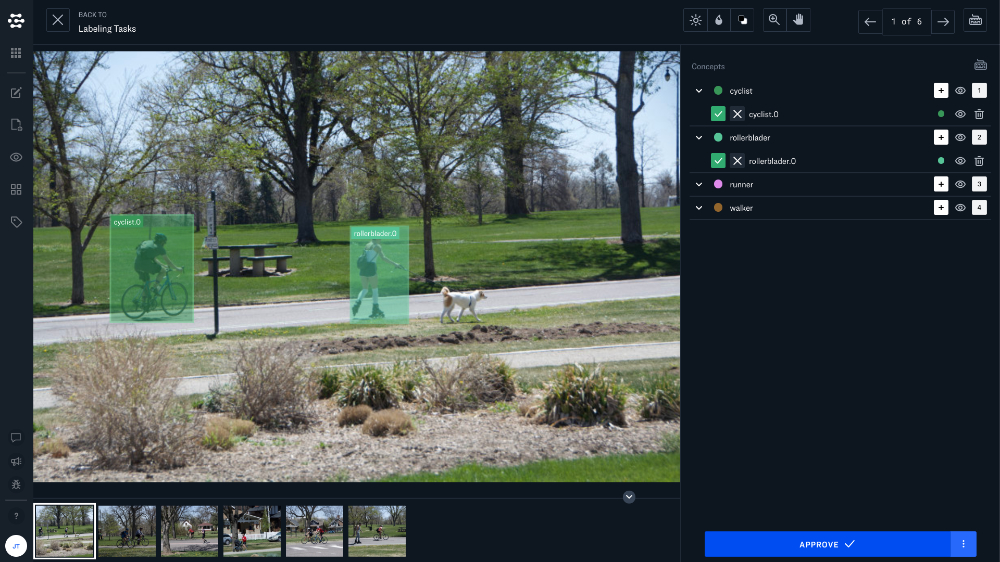
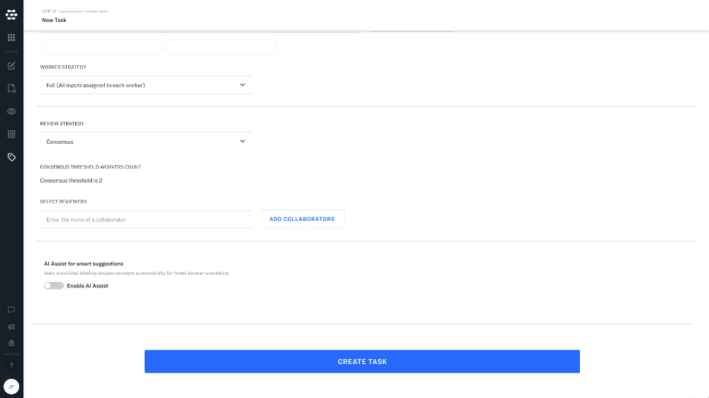
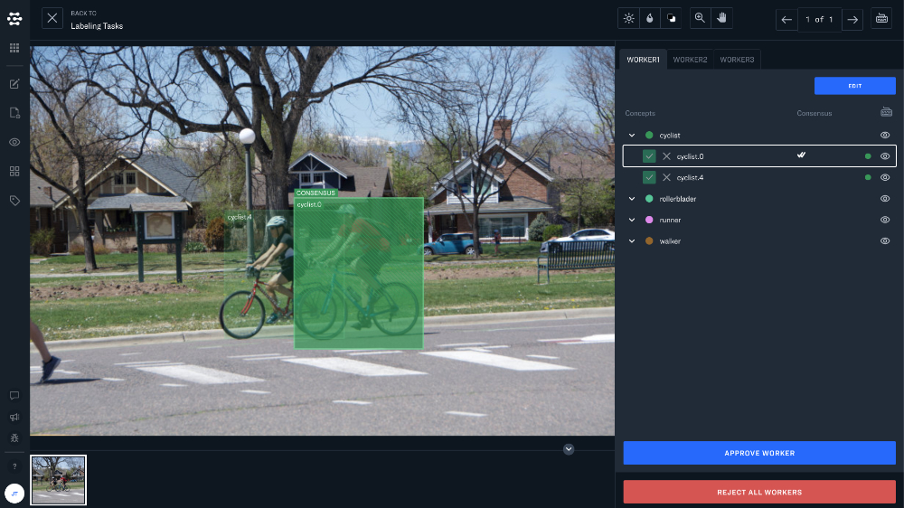

# Review

Clarifai provides many useful tools and features to help you manage your labeling workforce and review their work for quality control and training purposes.

When you create a new task, you can chose between two review strategies:
* **Manual Review** - Review and approve each labeled input individually.
* **Consensus Review** - If you have multiple labelers who are each labeling the same inputs, you can use consensus review to help automate the process of reviewing your labelers work. Consensus review will automatically identify cases where your reviewers agree on a given label, so that you can quickly approve labels where multiple labelers agree.

## Manual Review

We recommend manual review when you need to spot check your labeler work, or when you want to review each individual input that a labeler has worked on. Just select "Manual" under Review Strategy. Adjusting the sample size will give you a subset of the total labeled dataset, so that you can spot check your labeler's work. You will also need to select a reviewer for your task, this can be you or another one of your collaborators.

When you click on your review tasks under the review tab, you will be taken to a view where you can review and approve each labeled input. You can add additional annotations yourself in this view.

## Consensus Review

Consensus review is a fantastic tool if your labeling task involves multiple labelers labeling the same data set. Consensus review will automatically detect when your labelers have annotated an input in the same way, so that you can approve labels quickly without reviewing the individual work of each labeler.

You will see a "worker" tab in the righthand sidebar when reviewing labels. Any time the annotations of more than one worker agree you will see a double check mark next to the concept. You can approve labels that have been added by one worker, or even reject the labels of all of your workers if the labels do not meet your quality standards. 

