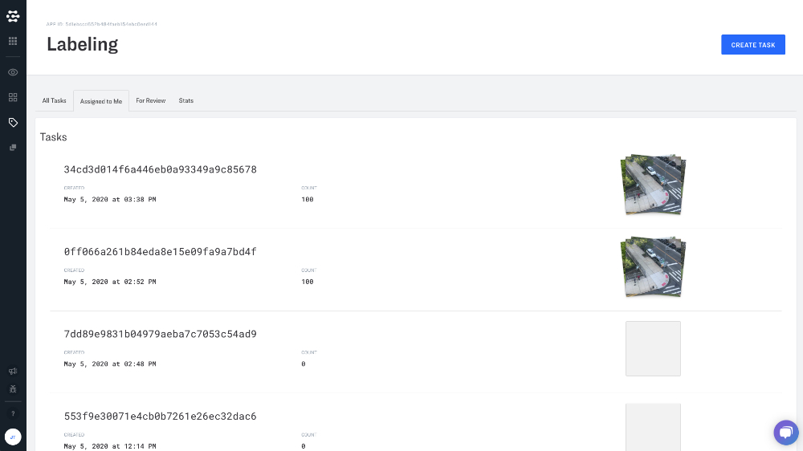

Labeler provides a variety of workforce management tools that help your company to distribute and manage labeling tasks.

## All tasks

A listing of all tasks associated with a given app.

## Assigned to me

A listing of all tasks assigned to the current user of the app.

## For Review

A listing of all tasks to be reviewed by the current user of the app.

## Stats

Stats provide performance metrics for your team

Time

Collaborators

Tasks

Labels created

Time per label
