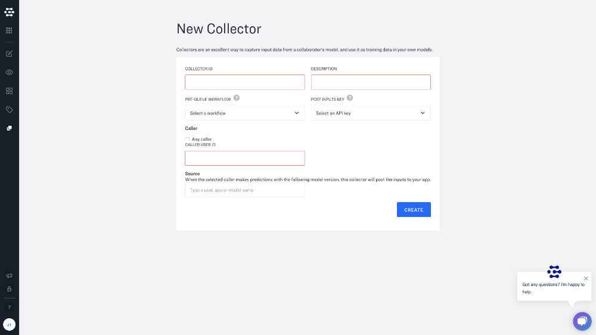

Collectors capture input data for your app. They enable you to pipe in data from production models automatically, and are the key to unlocking many platform training capabilities like active learning. Collectors are available with Essential and Enterprise plans to help you manage data ingestion at scale.

You can create app-level collectors to monitor specific models and specify sampling rules for triggering data ingestion.

## Creating a new collector

Collectors help you to feed your models with real-world training data. This data can be taken from models that you have already deployed to production. Just create a collector within your app and set it up to ingest data from another model when new inputs are "posted" to this model.

### Collector ID
Give your collector a useful and descriptive name.

### Description
Provide additional details.

### Pre-queue workflow

Pre-queue workflows allow you to specify sampling rules for triggering data ingestion.

In many scenarios, you will only want to ingest a sample, or subset of a given data source into your app. Pre-queue workflows allow you to pre-process your inputs so that you can sample and filter your new data before it is ever added to your app.

Common pre-queue workflows are designed to:

* Randomly sample inputs
* Filter inputs by metadata
* Filter inputs with a maximum probability below a given threshold
* Filter inputs with a minimum probability above a given threshold
* Filter specific concept probabilities above a given threshold

### Post Inputs key

Select the API key that you would like to use to allow new inputs to be posted to your app. This API key must have the PostInputs scope, since it grants the collector the authority to POST inputs to your app.

### Caller

Choose to only ingest inputs from a specified user, or anyone who posts new inputs to a model.  The user is referred to as the "caller" since they are making API calls as they post new inputs to their model. Just input the caller's user ID, or select "Any caller" to accept inputs from anyone posting new inputs to the model.

### Source

Select the model that you would like to collect from, and the collector will automatically post the new inputs to your app. Simply enter your model name, or model ID number. You can select the model that you would like to collect from in the drop down menu.
