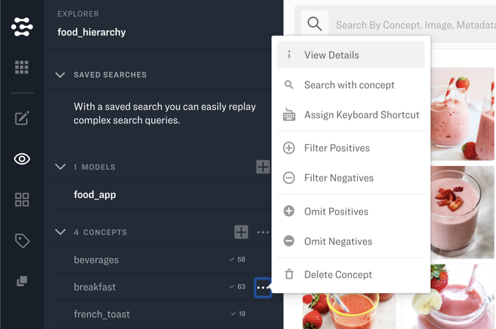
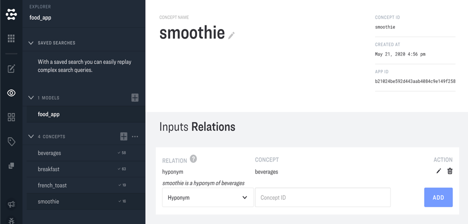

The Clarifai Knowledge graph enables you to map the custom concepts in your model to a common set of concepts. The knowledge graph makes it possible to link data across multiple custom and pre-built models in a meaningful way.

The knowledge graph is organized by the relationship between concepts as either hypernyms, hyponyms, and synonyms.

*Hyponym* represents an 'is_a_kind_of' relation. The following relationship: 'honey' (subject), 'hyponym' (predicate), 'food' (object) is more easily be read as 'honey' 'is a kind of' 'food'.

*Hypernym* is the opposite of 'hyponym'. When you add one of the relationships the opposite will automatically appear for you in queries. The 'hypernym' can be read as 'is a parent of' so: 'food' (subject), 'hypernym' (predicate), 'honey' (object)can more easily be read as:'food' is a parent of 'honey'.

*Synonym* The 'synonym' relation defines two concepts that essential mean the same thing. This is more like a "is" relationship. So for example a 'synonym' relationship could be: "puppy" is "pup" The reverse is also true once the former is added so: "pup" is "puppy" will appear in queries as well.

// get this up for portal too

You can create these mappings in your application with a few easy steps.  

1. Consider the following application that has four concepts: beverages, smoothie, breakfast, and french_toast. You can use the Knowledge Graph to create hierarchical relationships between the concepts.

2. You can link concepts as hierarchical by going to the details of either of the concepts. In the shown application, french_toast falls under breakfast. You can link them by accessing the View Details section of either concept.

3. Once, in the details dashboard, you can link breakfast as a hypernym to french_toast under the Input Relations menu.

4. Once you list breakfast as a hypernym to french_toast, it will set french_toast as a hyponym to breakfast automatically.

5. This process can be used to create similar relationships between beverages and smoothie. Beverages will be listed as a hypernym to smoothie.

6. By doing this, smoothie will be listed as a hyponym to beverages automatically.

1) For example, 'hyponym' is a type of predicate which represents 'is_a_kind_of' relation so the following relationship: 'honey' (subject), 'hyponym' (predicate), 'food' (object)
Can more easily be read as: 'honey' 'is a kind of' 'food'.

2) The 'hypernym' relation is the opposite of 'hyponym' and when you add one of the relationships the opposite will automatically appear for you in queries. The 'hypernym' can be read as 'is a parent of' so: 'food' (subject), 'hypernym' (predicate), 'honey' (object)can more easily be read as:'food' is a parent of 'honey'
3) The 'synonym' relation defines two concepts that essential mean the same thing. This is more like a "is" relationship. So for example a 'synonym' relationship could be: "puppy" is "pup"
The reverse is also true once the former is added so: "pup" is "puppy" will appear in queries as well.
