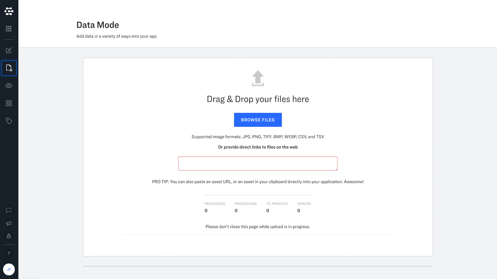

# Your Data

Upload your inputs into the Clarifai platform for data labeling, training new models, search, or predictions. The platform can upload images, video and text from URLs or from a local directory.

* 128 is the maximum number of images that can be sent at once
* Each image should be less than 20MB

## Data Mode

Data mode is here to make it easy for you load data into your applications. Just browse your files or provide direct links to files on the web. You can also add text directly by clicking "add text".

