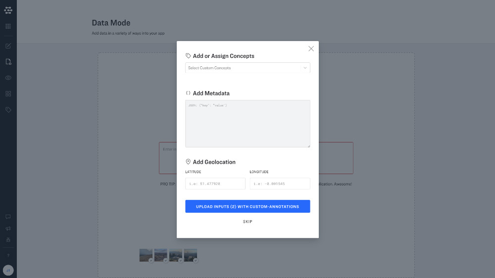

# Bulk Labeling

Clarifai provides a number of convenient ways to label multiple inputs at once in data mode.

## Bulk Labeling at Upload Time

You can label your inputs right as they are uploaded with bulk labeling at upload time. You will see a screen

## Bulk Labeling in Explorer

Once inputs have been uploaded to your application, you can easily add labels within Explorer's "grid view". Simply click the checkmark next to any input that you would like to label. You can even select multiple inputs by holding down the "shift" key.

### Metadata

You can "add metadata to selected". You have the option to merge or overwrite existing metadata tags by toggling.

Once labeled with metadata, you can view your metadata label in the righthand sidebar under the "Metadata" tab, or even search by metadata in the search field.

### Geodata

You can "Add geodata to selected".

Once labeled with geodata, you can view your input on the world map under the righthand tab called "Geographical Data"

