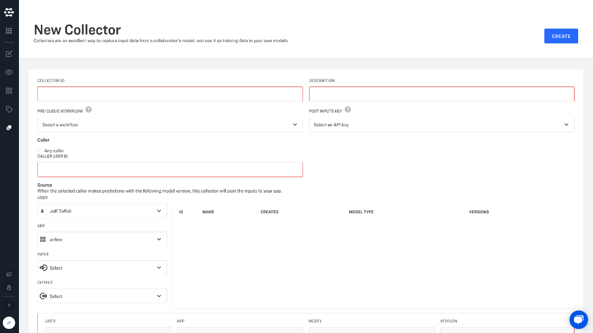

# Collectors

## Collectors

Collectors capture input data for your app. They enable you to pipe in data from production models automatically, and are the key to unlocking many platform training capabilities like active learning. 

> Collectors are available with Professional and Enterprise plans to help you manage data ingestion at scale.

You can create app-level collectors to monitor specific models and specify sampling rules for triggering data ingestion. Collectors can only collect data from apps where you are the app owner.

### Creating a new collector

Collectors help you to feed your models with real-world training data. This data can be taken from models that you have already deployed to production. Just create a collector within your app and set it up to ingest data from another model when new inputs are "posted" to this model.

## Collectors

Collectors capture input data for your app. They enable you to pipe in data from production models automatically, and are the key to unlocking many platform training capabilities like active learning. Collectors are available with Essential and Enterprise plans to help you manage data ingestion at scale.

You can create app-level collectors to monitor specific models and specify sampling rules for triggering data ingestion.

### Collector Parameters

#### Collector ID

Give your collector a useful and descriptive name.

#### Description

Provide additional details about your collector.

#### Pre-queue workflow

In many scenarios, you will only want to ingest a sample, or subset of a given data source into your app. Pre-queue workflows allow you to pre-process your inputs so that you can sample and filter your new data before it is ever added to your app. Pre-queue workflows allow you to specify sampling rules for triggering data ingestion. Common pre-queue workflows are designed to:

* Randomly sample inputs
* Filter inputs by metadata
* Filter inputs with a maximum probability below a given threshold
* Filter inputs with a minimum probability above a given threshold
* Filter specific concept probabilities above a given threshold
* Knowledge graph mapping from public General model concepts to a custom model

At least one \(pre-queue or post-queue\) workflow ID is required. The input to this workflow is going to be the OUTPUT of the model. We recommend that you use fast and light-weight models in it as it will effect the speed of the predictions being made.

#### Post Inputs key

Select the API key that you would like to use to allow new inputs to be posted to your app. This is the post-queue workflow ID of the workflow to run to after the collector is processing the queued input. This API key must have the PostInputs scope, since it grants the collector the authority to POST inputs to your app.

This workflow uses the original input to the model as input to the workflow so that you can run additional models as well on that input to decide whether to queue the model or not. If the workflow output has any field that is non-empty then it will be passed on to POST /inputs to the destination app. At least one \(pre-queue or post-queue\) workflow ID is required.

#### Source

Select the model that you would like to collect from, and the collector will automatically post the new inputs to your app. Simply enter your model name, or model ID number. You can select the model that you would like to collect from in the drop down menu. When the user predicts an input against this model, the input is going to be collected.

The app ID and user ID where the model is located. If using a publicly available model, the model user and app ID should be `clarifai` and `main`, respectively. Otherwise the IDs should belong to the user who created the model. An API key ID using which the inputs are is going to be added.

