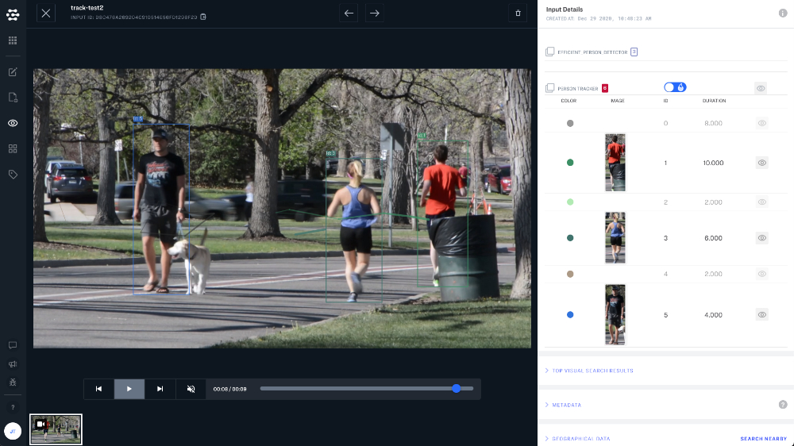
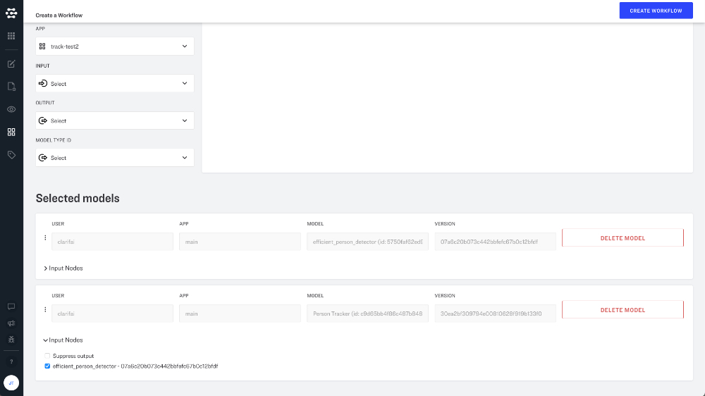

# Object Tracking

## Track people and objects across multiple frames

Videos are actually made up of a sequence of still images. Detection models can identify individual people and objects in still images, but they are not able to maintain these identities across frames. That is, they are not able to say that the person in one frame video is the same as the person in the next frame of video.

This is where object tracking comes in. Clarifai offers convenient, pre-built object tracking workflows that help you identify and track objects and people across multiple frames of video.

## Build an object tracking workflow

To build an object tracking workflow, just visit model mode and click the create workflow button in the upper righthand corner of the screen. From here you will need to add two models to your workflow:

| Model | ID |
| :--- | :--- |
| efficient person detector | 5750faf62ed9d514b9ee9d2d163f172e |
| Person Tracker | c9d65bb4f86c487b848e9400725168d4 |

Just add these two models to your workflow and connect the efficient person detector to the input node on the Person Tracker.

## Limitations

Please keep in mind that video support is in Beta. Any video of 100MBs or less that is less than 1 minute can be processed at 10 FPS for any workflow. Download is 20 second limit per job assuming 5MB/sec.

