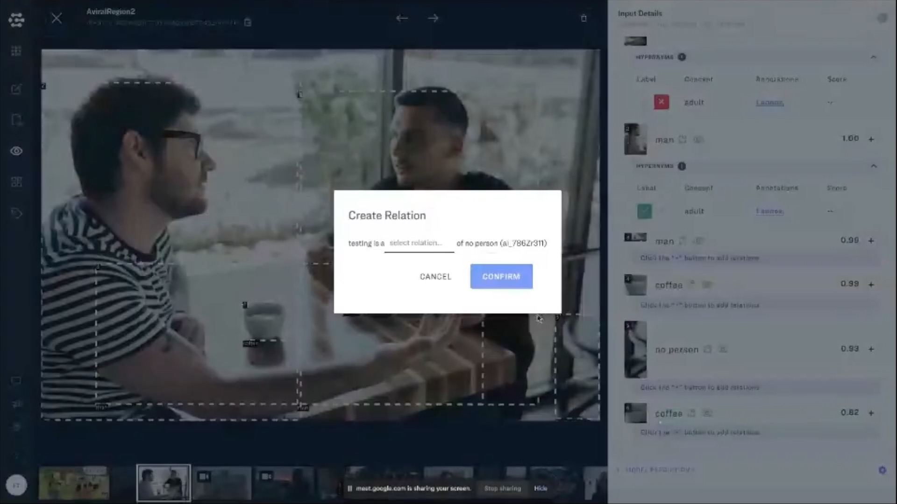
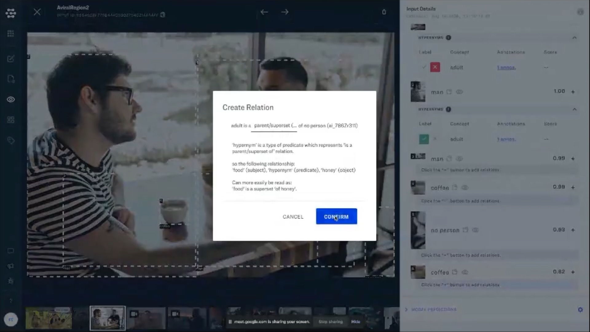

# Proposals



## Build model and concept hierarchies

Organizing models and concepts hierarchically can be very useful when working with large and complex model taxonomies.

### Concept hierarchies

By establishing concept hierarchies you can build applications that can account for the fact that child concepts \(like table\) are related to parent concepts \(like furniture\). Learn more about working with concept relationships with the [Clarifai Knowledge Graph. ](https://old-docs.clarifai.com/portal-guide/concept/knowledge_graph)

### Model hierarchies

By establishing model hierarchies you can establish relationships between grouping models and ranking models. This parent-child relationship can help address very common real world problems in AI, where you will first want to group subsets of your data together, before processing with more specialized models. You can choose any custom or pre-built model as your grouping and ranking models.

