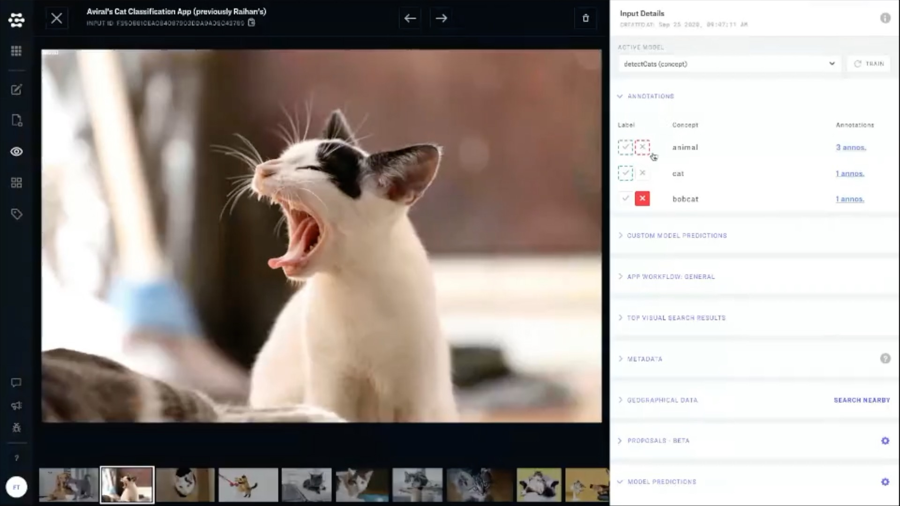
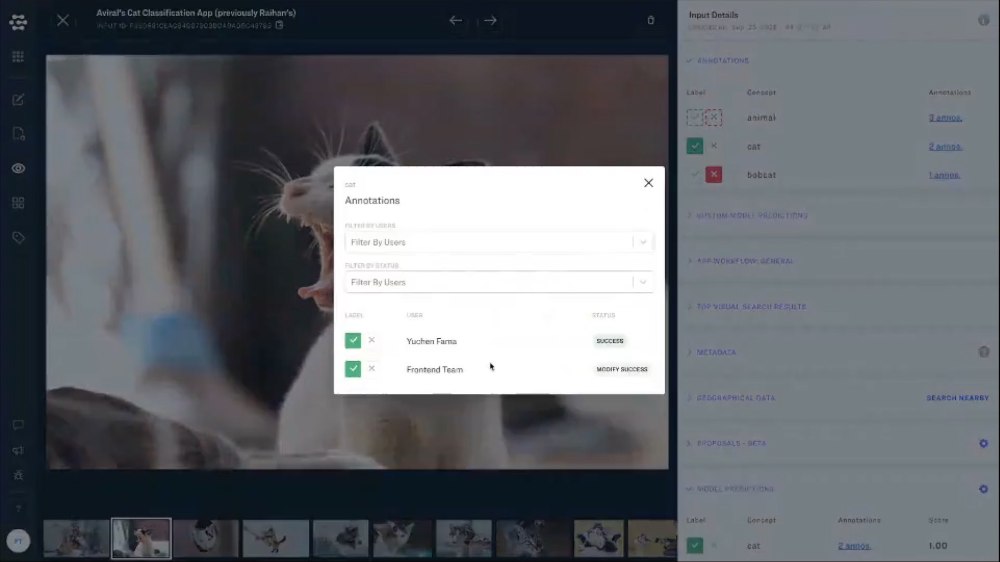
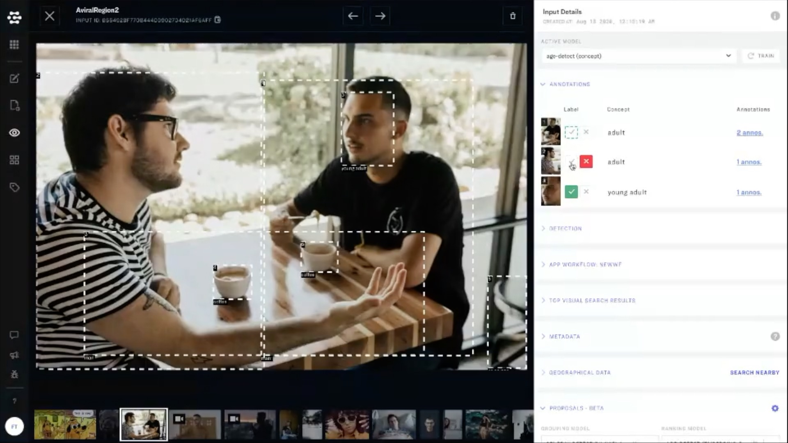

# Annotations

### View all annotations on a given input

Annotations can be easily reviewed in the annotations tab in the righthand sidebar of Explorer. Any time an annotation has been added by you, the logged-in user, you will see a solid green checkmark, or a solid red "x".

### View the work of individual annotators

You can view all annotations and the annotators who added them by clicking the "x-annos" link in the rightmost column of the annotation tab. An aggregate view window will pop up and you can review the work of your annotators here, and resolve any potential conflicts between annotations. 

### Work with both classification and detection apps

The annotation tab also supports both classification and detection apps. 

