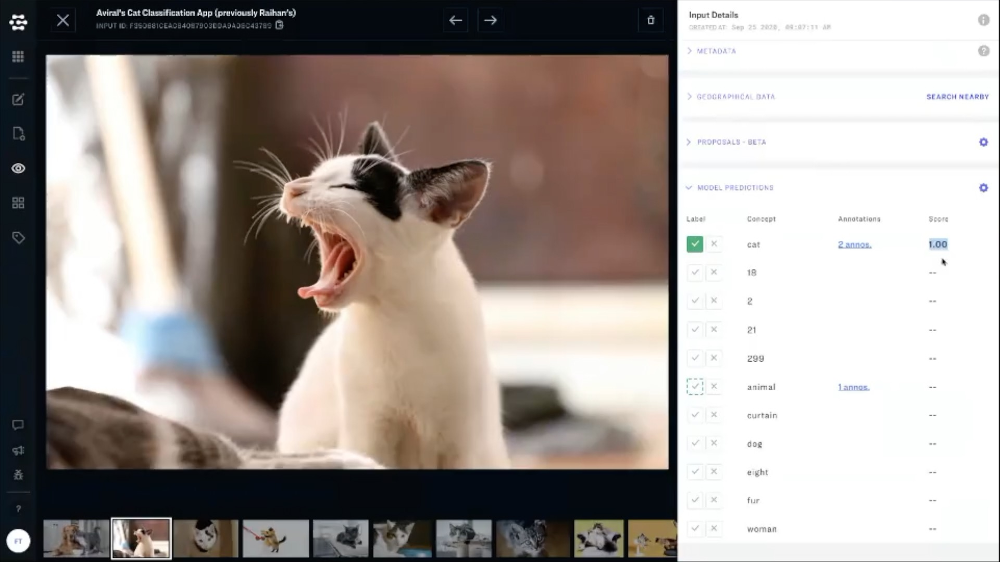

# Predictions

The prediction tab will show you all annotations for a given input and will provide additional information about who added a given annotation. Any time an annotation has been added by you, the logged-in user, you will see a solid green checkmark, or a solid red "x". 

You can view your model predictions in the righthand most column of the prediction tab. 

