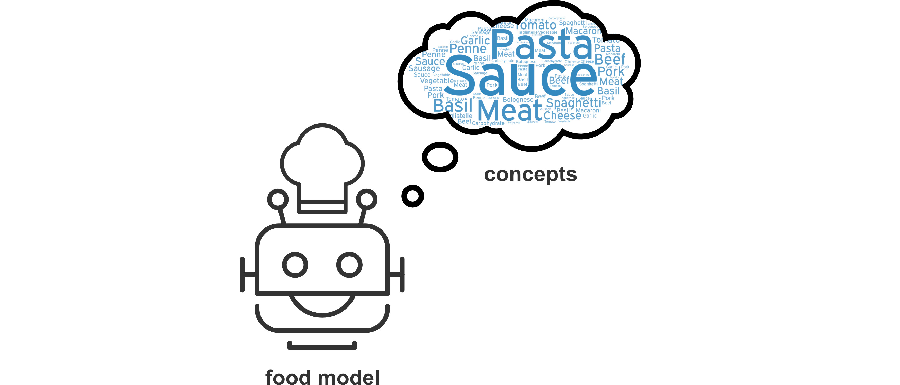

# Model

Clarifai provides many different models that understand the world differently. There are times when you wish you had a model that understands the world the way you do. The API allows you to do this. You can create your own model and train it with your own images and concepts. Once you train it to see how you would like it to see, you can then use that model to make predictions.


A model contains a group of concepts. A model will only see the concepts it contains.


To work with models in Portal, click on the Model Mode tab. From here you can create, edit and workflow your models.

