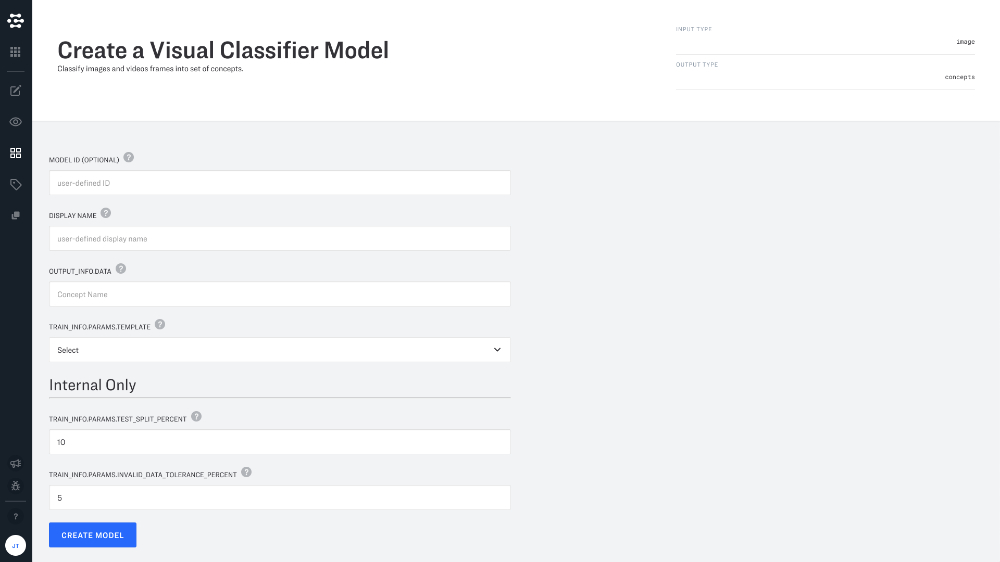

# Deep training

Clarifai offers a variety of prebuilt models that are designed to help you build AI solutions quickly and efficiently. Clarifai Models are the recommended starting point for many users because they are easy to work with and produce great results.

But there are many cases where accuracy and the ability to carefully target solutions takes priority over speed and ease of use. For these cases, it is also possible to "deep train" your custom models and integrate them directly within your workflows.

You might consider deep training if you have:
* **A custom tailored dataset**
* **Accurate labels**
* **Expertise and time to fine tune models**

## Template types

You can take advantage of a variety of templates when building your deep trained models. Templates give you the control to choose the specific architecture used by your neural network, and also define a set of hyperparameters that you can use to fine-tune the way that your model learns.

#### Classification

Classification templates let you classify what is in your images or videos.

* **InceptionV2** A best in class CNN designed to reduce information loss or “representational bottleneck”. Convolutions are designed to minimally alter the dimensions of an input. Smart factorization methods are used to keep computation efficient.
* **InceptionBatchNorm** Combines InceptionV2 with a deep learning technique called Batch Normalization (BN) to deliver higher accuracy and faster training speed. BN is used for normalizing value distributions before each layer is processed.
* **InceptionResnetV2** Residual connections allow shortcuts in the model so that you can train even deeper neural networks. This has also enabled significant simplification of the Inception blocks and improved performance.
* **ResNext** A simple, highly modularized network architecture for image classification. Constructed by repeating a building block that aggregate a set of transformations with the same topology. Uses a homogeneous, multi-branch architecture that has only a few hyper-parameters to set.

#### Detection

Detection templates make it easy to build models that can identify objects within a region of your images or videos. Detection models return concepts and bounding boxes.

* **InceptionV2** A best in class CNN designed to reduce information loss or “representational bottleneck”. Convolutions are designed to minimally alter the dimensions of an input. Smart factorization methods are used to keep computation efficient.
* **InceptionV4** A pure Inception variant without any residual connections. It can be trained without partitioning replicas. Features memory optimization for backpropagation.

#### Embedding

Embedding models can be useful in their own right (for applications like clustering and visual search), or as an input to a machine learning model for a supervised task. In effect, embedding templates enable you to create your own "base models" that you can then use in  your workflows.

* **InceptionBatchNorm** Combines InceptionV2 with a deep learning technique called Batch Normalization (BN) to deliver higher accuracy and faster training speed. BN is used for normalizing value distributions before each layer is processed.
* **ResNext** A simple, highly modularized network architecture for image classification. Constructed by repeating a building block that aggregate a set of transformations with the same topology. Uses a homogeneous, multi-branch architecture that has only a few hyper-parameters to set.

## Hyperparameters

Deep training gives you the power to tune the hyperparameters that affect “how” your model learns.

* **average_horizontal_flips** Provides basic data augmentation for your dataset. If set to true, there is a 0.5 probability that current image and associated ground truth will flip horizontally.
* **base_gradient_multiplier** This sets the learning rate of the pre-initialized base (also sometimes called "backbone") model that generates embeddings. Learning rate controls how the weights of our network are adjusted with respect to the loss gradient. The lower the value, the slower the trip along the downward slope. A low learning rate can help ensure that local minima are not missed, but can take a long time to converge — especially if the model gets stuck on a plateau region.
* **batch_size** The number of images used to make updates to the model. Increased batch size allows for a better approximation of gradient over those samples. Batches allow for stochastic gradient descent, by choosing a random set of X images for each training update. You may want to increase batch size if the model is large and taking a long time to train. You also may want to increase the batch size if your total number of model concepts is larger than the batch size (you may want to increase to around 2x the category count).
* **detection_score_threshold** Only bounding boxes with a detection score above this threshold will be returned.
* **image_size** The size of images used for training. Images are scaled for efficient processing, and a lower number will take up less memory and run faster. A higher number will have more pixel information to train on and will increase accuracy.
* **init_epochs** The initial number of epochs before the first step/change in the **lrate**.
* **logreg** Set to True to use **logistic regression**, set to False to use **softmax** (for binary classification).
* **lrate** The learning rate is a tuning parameter in an optimization algorithm that determines the step size at each iteration while moving toward a minimum of a loss function.
* **num_epochs** An epoch is defined as one-pass over the entire dataset. If you increase it, it will take longer to train but it could make the model more robust.
* **num_items_per_epoch** The number of training examples per "epoch". An epoch would be defined as one-pass over this amount of examples.
* **per_128_lrate** Total change in **lrate** after 128 images processed. This is calculated as lrate = per_128_lrate * (batch_size / 128).
* **per_item_lrate** The rate that model weights are changed per item.
* **step_epochs** The number of epochs between applications of the step/change in **lrate** scheduler.
* **test_freq** The number of epochs should you run before evaluation of the test set. Increased frequency can allow for more granular testing but will extend processing time.
* **use_perclass_regression** Enables box coordinate local regression on a per-class basis. When set to True there will be `num_classes` sets of regressors for each anchor location, when set to False, there will be one coordinate regressor for each anchor location.

## Create your Deep Trained Model

Creating and working with deep trained models is very similar to working with Clarifai Models.

#### Create your app and upload your inputs

Get started by creating your app and uploading your inputs.

In general, deep trained models need more data than ones trained on top of Clarifai Models. For most applications you’ll need at least 1000 training inputs, but it could be much more than this depending on your specific use case.

#### Create your concepts and label your inputs

The process of creating concepts and labeling inputs is the same for deep trained models and Clarifai Models.

#### Choose your template and train

Just create a new model in explorer or model mode and choose the template that you would like to use for the model. Keep in mind that deep training can take longer than training with Clarifai Models.

