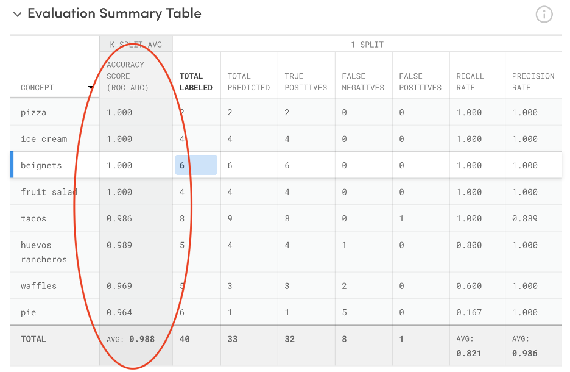
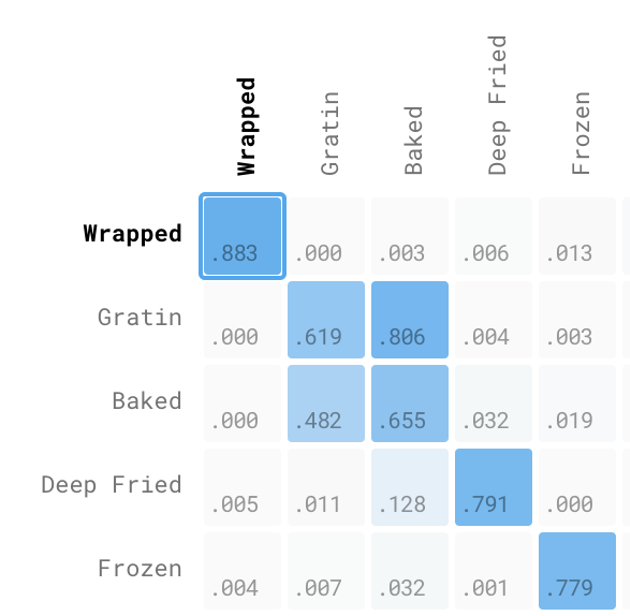

# Interpreting Evaluations

Once the Model Evaluation is complete, you’ll be able to view the evaluation results in Portal.

We suggest that you start by looking at the Concept by Concept Probabilities Results and the Summary Table to get a sense of the overall model prediction performance and identify the high-performing and low-performing concepts. Afterwards, hone-in on the Selection Details of the False Positives and False Negatives to identify any biases, if any, in how the model is predicting, and to correct any inputs that are mislabeled

Generally, you’ll be looking at results that represent either a\) the average across K splits, or b\) the test set of a single split, which is about 1/K of your original training set. Note that a single split will be capped at 1,000 inputs.

## Model Analysis

### Model Accuracy Score

Model Accuracy Score is the highest level metric for your model’s prediction performance. It is defined as the macro average of the areas under the receiver operating characteristic curve for every concept. This metric does not depend on the Prediction Threshold. This metric is an average across K splits.

A score of 1 represents a perfect model; a score of .5 represents a worthless model. As a general rule of thumb, a score above .9 is considered good.

Note that we discourage users from making a final assessment of the model accuracy based on the Model Accuracy Score only.

## Concept Analysis

### Prediction Threshold

Probability threshold determines the model’s predictions. The default threshold is .5. The input is predicted as \(i.e. “counts” as\) as a concept, such as “dog”, only if the prediction probability for “dog” is higher than the set threshold, for example, 0.5. You can adjust the threshold depending on how ‘strict’ you want your classification to be.

All prediction binary metrics, such as True Positives, False Negatives, and False Positives, and Total Predicted, Recall Rate, Precision Rate, depend on this threshold.


#### Choosing a Prediction Threshold

A threshold is the “sweet spot” numerical score that is dependent on the objective of your prediction for _recall_ and/or _precision_. In practice, there are multiple ways to define “accuracy” when it comes to machine learning, and the threshold is the number we use to gauge for our preferences.

You might be wondering how you should set your classification threshold, once you are ready to use it to predict out-of-sample data. This is more of a business decision, in that you have to decide whether you would rather minimize your False Positive Rate or maximize your True Positive Rate.

If our model is used to predict concepts that lead to a high-stakes decision, like a diagnosis of a disease or moderation for safety, we might consider a few false positives as forgivable \(better to be safe than sorry!\). In this case, we might want high precision.

If our model is used to predict concepts that lead to a suggestion or flexible outcome, we might want high recall so that the model can allow for exploration.

In either scenario, we will want to make sure our model is trained and tested with data that best reflects is use-case.

Once we have determined the goal of our model \(high precision or high recall\), we can use test data that our model has never seen before to evaluate how well our model predicts according to the standards we have set.


### Evaluation Summary

This table summarizes the numerical evaluation results for every concept. For every concept, it calculates:

#### K-Split Average

**ROC AUC \(Concept Accuracy Score\)**: The concept’s prediction performance score, defined by the area under the Receiver Operating Characteristic curve. This score gives us an idea of how well we have separated our different classes, or concepts.

A score of 1 represents a perfect model; a score of .5 represents a poor model. As a general rule of thumb, a score above .9 is considered good. Note: ROC AUC is not dependent on the prediction threshold.

ROC AUC is generated by plotting the True Positive Rate \(y-axis\) against the False Positive Rate \(x-axis\) as you vary the threshold for assigning observations to a given class. The AUC, or Area Under the Curve of these points is \(arguably\) the best way to summarize a model’s performance in a single number.

You can think of AUC as representing the probability that a classifier will rank a randomly chosen positive observation higher than a randomly chosen negative observation, and thus it is a useful metric even for datasets with highly unbalanced classes. A score of 1 represents a perfect model; a score of .5 represents a model that would be no better than random guessing, and this wouldn’t be suitable for predictions and should be re-trained. Note: ROC AUC is not dependent on the prediction threshold.

#### 1-Split

**Total Labeled:** Total number of inputs that were originally labeled as the concept in the test set. Total Labeled is the sum of True Positives \(correct\) and False Negatives \(incorrect\). Note: Total Labeled is not dependent on the prediction threshold.

**Total Predicted:** Total number of inputs that were predicted as the concept in the test set. This means these inputs were predicted as a concept with probability greater than the prediction threshold value. Total Predicted is the sum of True Positives \(correct\) and False Positives \(incorrect\).

**True Positives \(TP\):** Number of inputs that were correctly predicted as the concept they were actually labeled. Also known as “hits”. \(E.g. These are the images that were labeled as “dog” and were predicted as “dog”\)

**False Negatives \(FN\):** Number of inputs that were not predicted as the concept they were actually labeled. Also known as “misses”. \(E.g. These are the images that were labeled as “dog” but were not predicted as “dog”\)

**False Positives \(FP\):** Number of inputs that were predicted as the concept, but they were not labeled as the concept. Also known as “false alarms”. \(E.g. These are the images that were predicted as “dog” but were not labeled as “dog”\)

**Recall Rate:** proportion of the images labeled as the concept that were predicted as the concept. It is calculated as True Positives divided by Total Labeled. Also known as “sensitivity” or “true positive rate”.

**Precision Rate:** proportion of the images predicted as a concept that had been actually labeled as the concept. It is calculated as True Positives divided by Total Predicted. Also known as “positive predictive value”.

### Concept by Concept Results

A concept-by-concept matrix is a graphic flattening of data to show what has been labeled for a concept. This tool is another way of visualizing the performance of a model. It allows us to review where we see true positives, or correctly predicted inputs \(the diagonal row\). Simply put, this is an excellent tool for telling us where our model gets things right or wrong.

Each row represents the subset of the test set that were actually labeled as a concept, e.g. “dog”. As you go across the row, each cell shows the number of times those images were predicted as each concept, noted by the column name.

This matrix helps you understand:

* **Accuracy**: Overall, how often is the model correct?
* **Misclassification Rate**: Overall, how often is it wrong?
* **True Positive Rate**: When it's actually yes, how often does it predict yes?
* **False Positive Rate**: When it's actually no, how often does it predict yes?
* **Specificity**: When it's actually no, how often does it predict no?
* **Precision**: When it predicts yes, how often is it correct?
* **Prevalence**: How often does the yes condition actually occur in our sample?

#### Counts \(1-Split\)

The "count" is the the number of inputs that were predicted as a concept.

Each row represents the subset of the test set that were actually labeled as a concept, e.g. “dog”. As you go across the row, each cell shows the number of times those images were predicted as each concept, noted by the column name.

The diagonal cells represent True Positives, i.e. correctly predicted inputs. You’d want this number to be as close to the Total Labeled as possible.

Depending on how your model was trained, the off-diagonal cells could include both correct and incorrect predictions. In a non-mutually exclusive concepts environment, you can label an image with more than 1 concept. For example, an image is labeled as both “hamburger” and “sandwich”, this image would be counted in both “hamburger” row and “sandwich” row. If the model correctly predicts this image to be both “hamburger” and “sandwich”, then this input will be counted in both on and off-diagonal cells.

Few things to note:

1. Remember that the prediction counts depend on the threshold. This means the images are counted toward a predicted concept only if the prediction probability for this concept is higher than the threshold.
2. This means the sum of the row may be less or greater than the \# of total labeled inputs that were labeled as the concept.
3. You can click on each cell to view the actual prediction results for every input that was counted in this cell.
4. This represents the test set data of a single split.

#### Probabilities \(K-Split Average\)

Each row represents the subset of the test set that were actually labeled as a concept, e.g. “dog”. As you go across the row, each cell shows the average prediction probability for each concept, noted by the column name, for all inputs in this subset. In short, the cell shows the average prediction probability for a concept given the images labeled as a concept.

Few things to note:

1. This matrix does not depend on the Prediction Threshold.
2. You can click on each cell to view the actual prediction results for every input that were used to calculate this cell.
3. This represents the average across all K splits.

#### Co-occurrence

Concepts that co-occur, or are similar, may appear as cluster on the matrix. In this sample matrix for a food model trained to predict the cooking preparation for foods, we see a cluster around ‘Gratin’ and ‘Baked’. Without context of what these concepts mean or how the training data appears, we can assume that the training data looks very similar, and it is \(‘Gratin’ IS a variant of baked preparation, only with cheese\). And so, clusters aren’t necessarily a bad thing, sometimes they are absolutely correct if the subject matter is naturally similar.

#### Noise

**1-2 Concept model \(left\)** : Hair Volume is graded as it appears from root to tip, either voluminous, or not voluminous **1-4 Concept model \(right\)** : Hair Volume is tiered depending on where it exists from the root, ends of the hair and hair length. Level 4 is the most distinct because it is dependent on the shortest hair length.

The matrix on the right is an example of a noisy matrix, compared to the binary model on the left, which has a more clearly defined diagonal line. Concepts trained with data that is too similar, too subtle to differentiate, or labeled across different concepts, will muddle the distinction between concepts, and will not form a clean diagonal line in a confusion matrix. In this case, the model on the left would be considered the ideal concept distinction.

## Input Analysis

### Selection Details

This Selection Details table shows the input-level details of the selection you made on the Summary Table or Concept by Concept Results. It shows the image input and prediction probabilities for a specific concept.

Note: the prediction probabilities on this table may seem different from your actual model’s probabilities. The reason is that all the evaluation results are based on the new model that was built for evaluation purposes during the cross validation process.

### Expanded Selection Details

You can click on the expand button to view the prediction probabilities for every concept for each image. The blue dot denotes the concept\(s\) the input was actually labeled, i.e. true positives. The red dot denotes the concept\(s\) that the input was not labeled.

