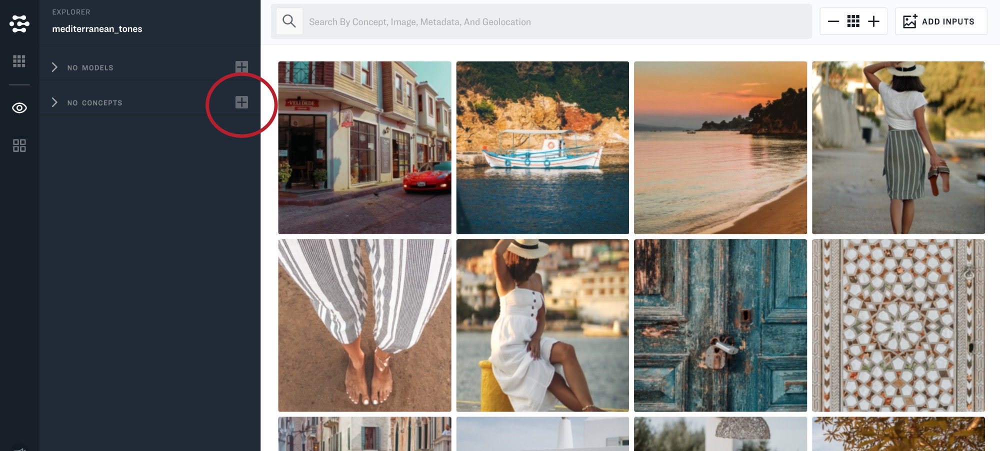

# Custom model walkthrough

First make sure that you have created an application and uploaded some images.

Just navigate to Explorer and click the "+" button next to "No Concepts".

Type in the name of a new concept and click "Add".

Select an image that you would like to annotate.

Click the check mark and then click train.

That's it! You have created a new custom model and you can instantly use your new concept as a search term.

