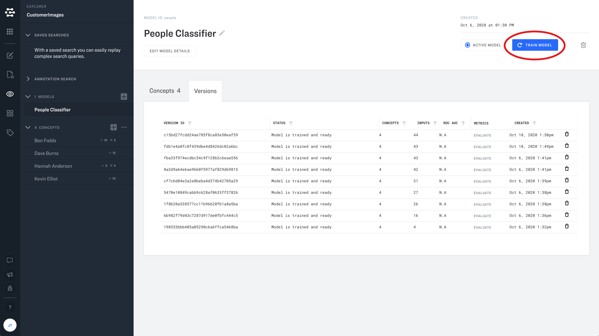

# Training Basics

When you are ready to train a model, just click the "Train" button in Explorer, or the "Versions" tab. Your model will be trained on all inputs that have been processed. You can also choose to train your model based on the results of a specific search query.

