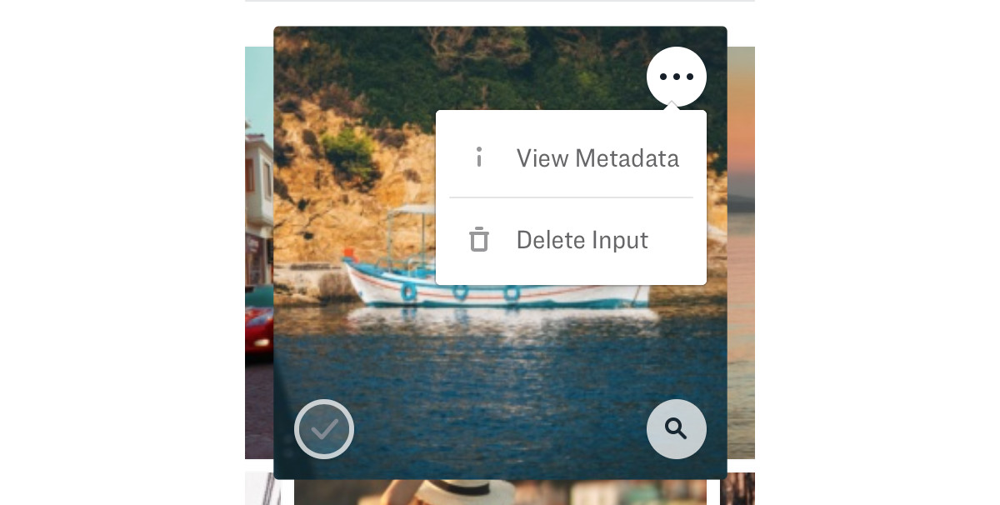

# Data management

## Add inputs

Adding new inputs couldn't be easier. Just navigate to the app that you want to add inputs to and click "Browse" or "Add inputs" in the upper right hand corner of the screen.

## Delete inputs

There are two ways to delete inputs in Portal.

### One at a time

Just navigate to the "three dots" icon and select "Delete Input"

### Multiple

Click the check box to select and image and then click the "Delete Inputs" button at the bottom of the screen.

