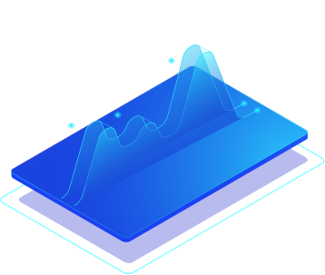

# Making Model Predictions

Portal analyzes your inputs and tells you what's inside of them. Portal will return a list of concepts with corresponding probabilities of how likely it is these concepts are contained within the image.

Predictions are ready the moment you upload an image. Just click on the image and view your predictions in the window on the right hand side of the screen.

