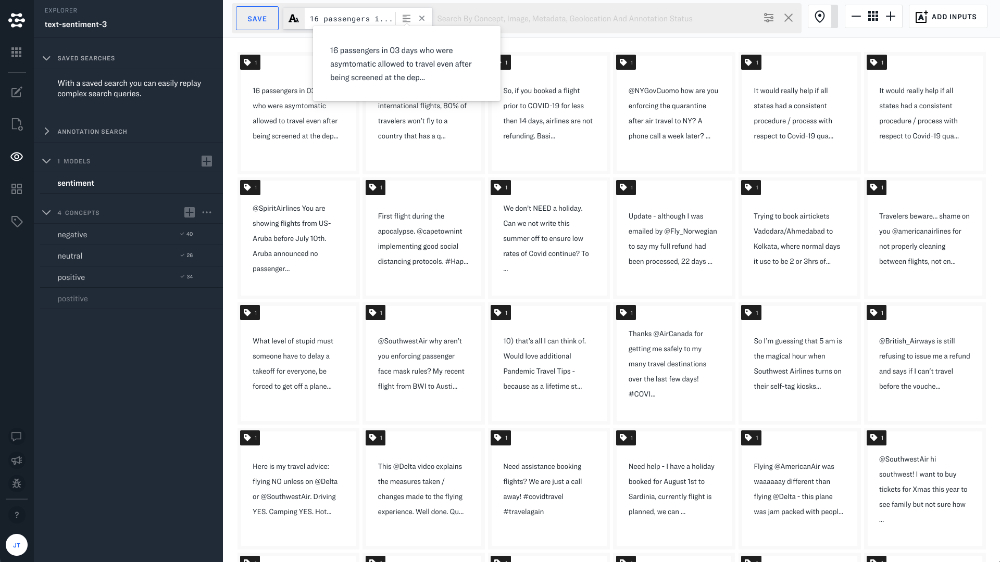
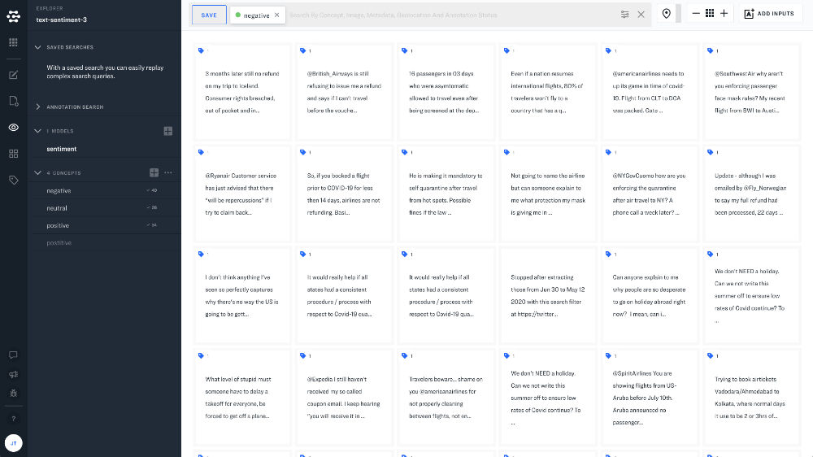

# Text Search

### Text similarity search

Much like an image-to-image search, Clarifai allows you to use text inputs as a parameters for search. Just hover over the text input that you would like to use, and click the magnifying glass icon. Searching by an input will display a search tag that will have a popup button to view a larger preview if the text length is above 15 characters. The popover preview within the search tag displays up to 100 characters.

### Search text by concept

You can search based on concepts by simply clicking on the name of the concept in the lefthand sidebar. You will see the concept added to the search bar and search results will be ranked based on inputs with the highest predicted values for a given concept. 

