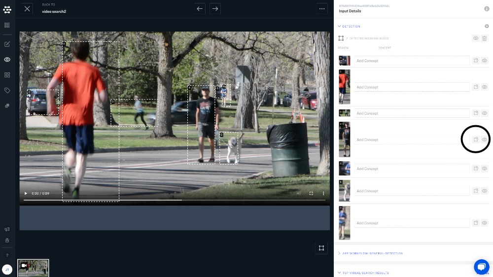

# Visual Search

With visual search, you can search for images in your application based on their "visual similarity" to other images. Visual search uses the same underlying technology that powers classification and detection, but does not require concepts. This means that you do not need to label or train your model with custom concepts, and you do not need to use any existing concepts in our pre-built models. Visual search ranks your data based on the similarity of visual characteristics alone.

Just keep in mind that visual search is not an "objective" measure of visual similarity. Visual search uses a model *embedding* to measure visual similarity. The embedding can be thought of as your model's "feature identifier". If you train your model on images of human faces, it will understand features like eyes, ears, noses and mouths; if you train your model on images of houses, it will understand features like windows, roofs and doors.

## Full Scene Visual Search

To perform a visual search that uses an entire image as an input (the "full scene"), just navigate to Explorer and click the magnifying glass icon in the bottom righthand corner of an image.

A thumbnail of your image will be added to the search bar and Explorer will display your inputs in a ranking from most visually similar to least visually similar.

## Localized Search

Localized search lets you perform visual searches by using the detected regions of an image. To perform a localized search, you will need to use a "Detection" model in your base workflow.

Navigate to the "Detection" window on the righthand side of the screen in Explorer. Here you will see the individual objects detected by your model. Just click the "magnifying glass over bounding box" icon next to the object that you would like to search with.

A thumbnail of your image will be added to the search bar, and Explorer will rank your inputs based on visual similarity to the region of the image that you searched with.

### Face Detection and Search

One common use for localized search is searching for images of specific people. Face detection behaves just like other detection models. Begin by creating an app that uses "Face" as the base workflow, and then click the "magnifying glass" icon next to the image of the person that you would like to search for.

## Visual Search in Video

**Now available for early access preview. Contact customer support for additional information**

You can also use full scene and localized search with video. Each frame of video is treated like an individual image. You can view detections and search with detected regions just like with still photos.

### The Timeline

When you search a region of a video, Explorer will display all still images and video frames that contain visually similar images to the region that you searched with. When you click on a frame of a video, the whole video will open in a timeline view. From here, and sections of video that contain visually similar images will be highlighted in green.

### Refine search

When working with a mix of video and still images in an application, you have the ability to refine your search results. You can choose to only view still images or only view videos in your search results. You can also choose detection thresholds, so that you can control how visually similar images will have to be to be returned in your search results.

