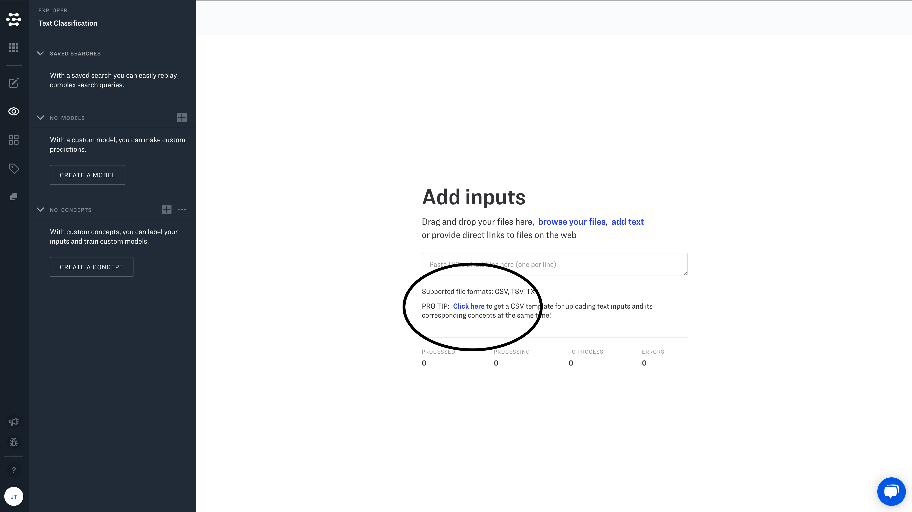

# Custom Text Models Walkthrough

<iframe src="https://youtu.be/-blQVbccAF0" frameborder="0" allow="autoplay; encrypted-media" allowfullscreen></iframe>

Text models can be trained to understand the meaning of text passages. We offer a general text embedding model, as well as a specialized text moderation model. This walkthrough shows you how to create a custom text model from our text embedding model.

## Create an app

Create a new application and select “Text” as your default workflow.

## Navigate to Explorer Mode

## Add your inputs

### Option 1: Browse your files

You can upload your text directly from a `.csv` file. This means you can work with your favorite spreadsheet software or text editor when preparing your data for upload. Just use the provided "CSV template" to get started.

Next, add your text data. At a minimum, you should add text to the `input.data.text.raw` field. You can add one concept per column to the `input.data.concepts[i].id` fields. For the `input.data.concepts[i].value` column, there are two options: enter the number `1` if the concept *is* present in the input, enter the value `0` if the concept is *not* present in the input (a negative example). If no value is entered, a default value of `1` will be assigned to your input.

You can add columns for as many concepts as you like, and you can add new columns to add values for any other values supported by the API:

|Field     |Description                                                 |
|-----------|--------------------------------------------------------|
|input.id | A unique identifier for your input|
|input.data.text.raw | The "text" for your input |
|input.data.concepts[i].id| Your custom concept |
|input.data.concepts[i].value | The value for your custom concept (`1` for true, `0` for false)|
|input.metadata| Any additional metadata in valid [JSON](https://www.json.org/json-en.html) format |
|input.data.geo.geo_point.latitude| Latitude for geodata |
|input.data.geo.geo_point.longitude | Longitude for geodata |

Finally, you will need to save your work as a `.csv` file. If you are editing in Google Sheets, go to File >>> Download >>> Comma-separated values (.csv, current sheet). If you are using Excel, go to File >>> Save As >>> Browse >>> Save as Type >>> CSV.

Once you have downloaded the `.csv` file, you can then upload it by clicking on “Browse your files”

### Option 2: Add text
Just click “add text” and directly enter your text in the text field.

Label your inputs
If you “add text” you will need to then label your inputs in Portal.

#### Add custom concepts
Click on an input and add new concepts in the right hand sidebar. Just click in the empty form field under “Custom Model Predictions”, enter your concept, and hit “return”.

## Navigate to Model Mode

## Select Context-based Classifier

* **MODEL ID (OPTIONAL)** - Optional custom model ID of your choosing.
* **DISPLAY NAME** - This is the name of your new custom model. Enter a descriptive name.
* **OUTPUT_INFO.DATA.CONCEPTS** - Click in the empty form field and select all of the custom concepts that you have added one-by-one.
* **OUTPUT_INFO.OUTPUT_CONFIG.CONCEPTS_MUTUALLY_EXCLUSIVE** - Use the default setting.
* **OUTPUT_INFO.OUTPUT_CONFIG.CLOSED_ENVIRONMENT** - Set CLOSED_ENVIRONMENT to “Yes”.
* **OUTPUT_INFO.OUTPUT_CONFIG.EMBED_MODEL_VERSION_ID** - Use the default setting.

Once you click “Create Model”, a new screen will appear.

Click “Train Model” in the upper right hand corner of the screen.

## Try out your new model
Navigate to “Explorer Mode” and “Add Inputs”. Add some new text inputs, and then navigate back to “Explorer Mode”

You will see custom concept predictions in the right hand sidebar when you click on an individual input.
