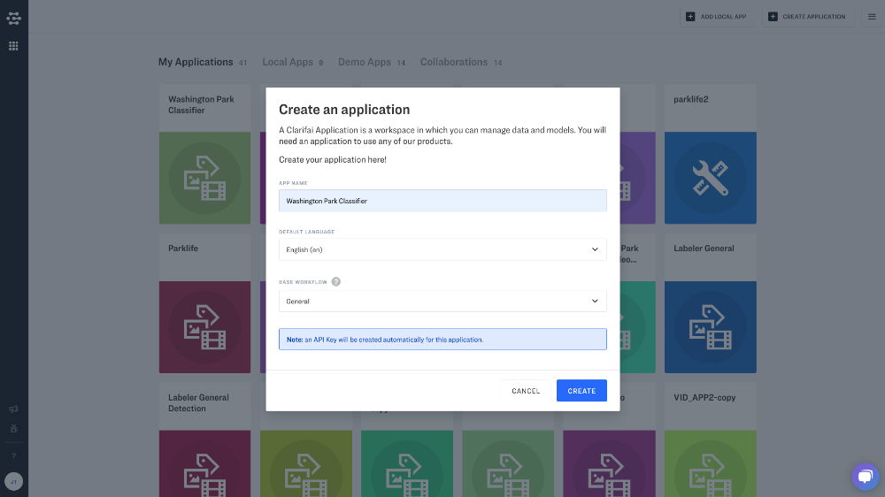
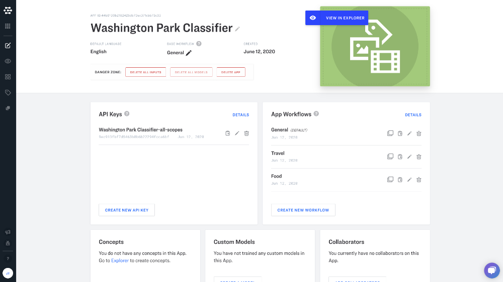
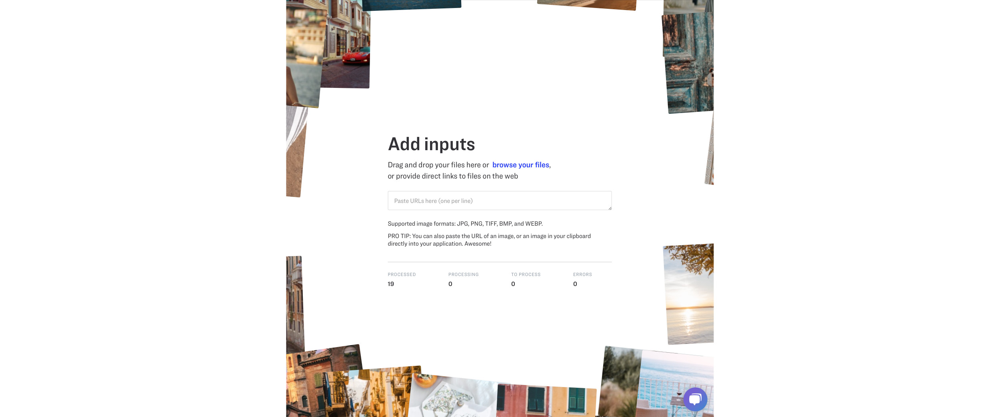
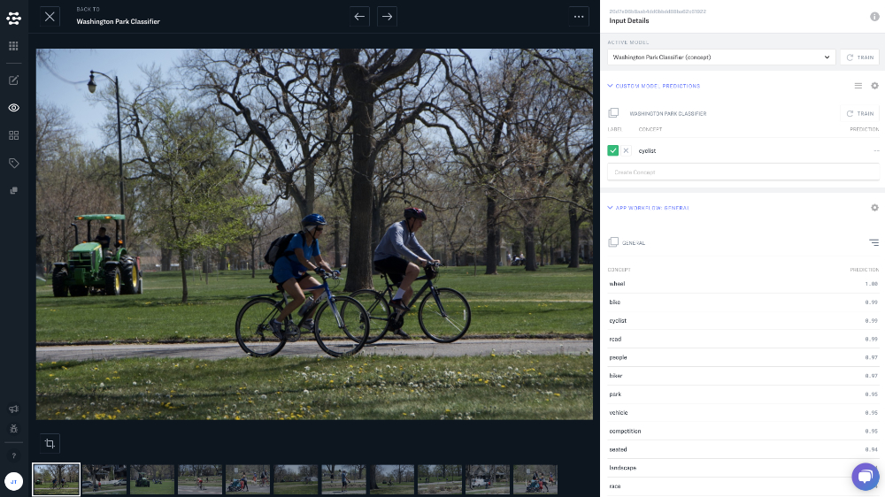
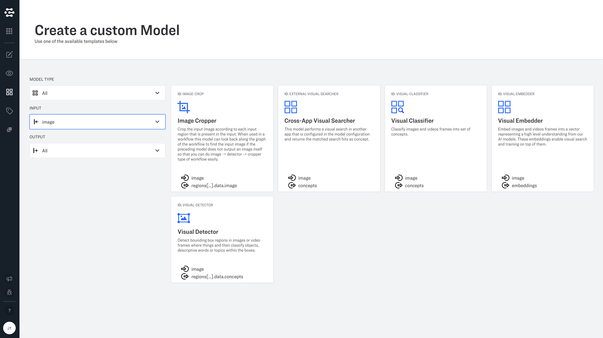
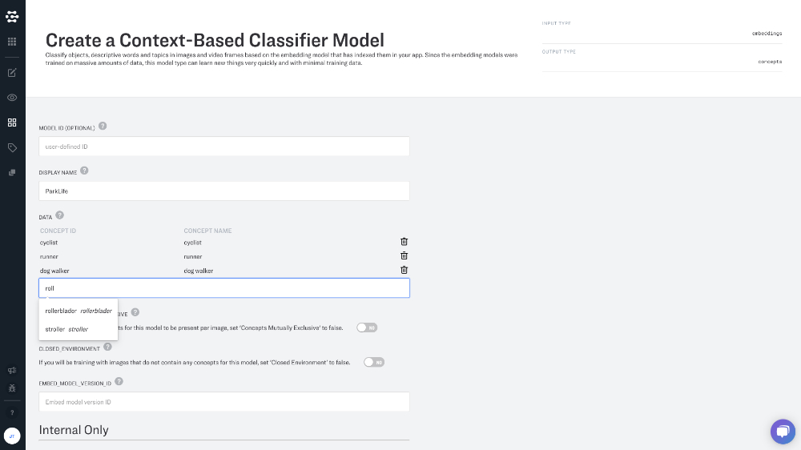
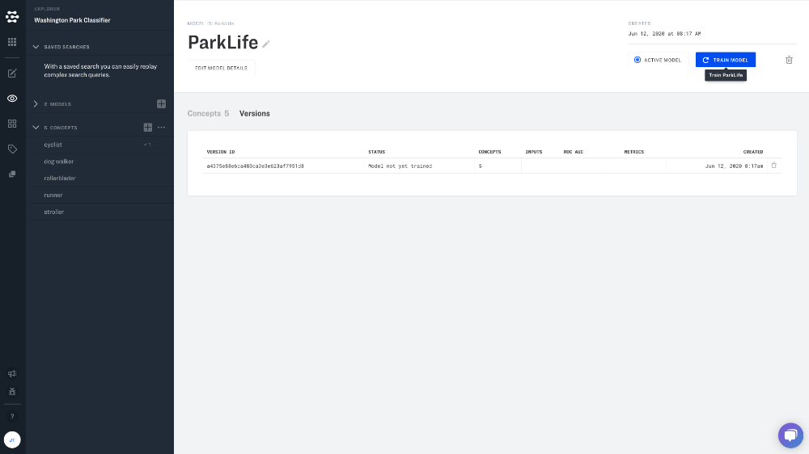

# Custom model walkthrough

To set up a new model, you will need to head over to the [Applications page](https://portal.clarifai.com/apps) through your account. Start by creating your new application.

Click "View in Explorer", or click the "eye" icon in the lefthand sidebar.

Add your inputs. Just click "browse your files" or paste image URLs in the space provided.

Click on an image. You can create new concepts and label your images in the right hand sidebar.

Navigate to Model Mode and select your model. Click on the "four squares" icon on the lefthand sidebar.

Click "Create Custom Model" to choose a model template. You can filter your results by:

* **Model Type** You can choose "Trainable" (machine learning), or "Non-Trainable" (fixed-function) models.
* **Input** Inputs currently accept Embeddings, Concepts, Image, Image or Video, Region Images, or Region Concepts.
* **Output** Outputs currently return Clusters, Color, Concepts, Embeddings, Region Embeddings, Region Concepts, Region Images, or Region Text.

For this example we choose a context-based classifier that can use a pre-trained Clarifai Model. From here we name the model, and add concepts that we have created. The available parameters vary based on the type of model that you choose. When you have configured the model the way you like it, click the "Create Model" button at the bottom of the page.

Finally, click the blue "Train Model" button in the upper righthand corner of the screen. Once it is trained you can put it to work by [adding it to your workflows](https://docs.clarifai.com/portal-guide/workflows).

