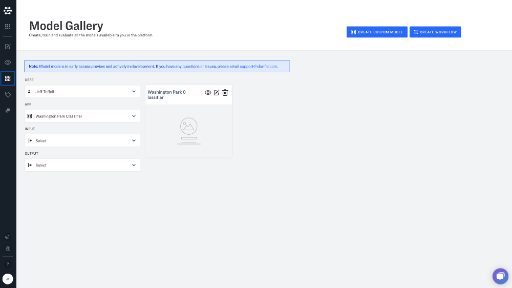

# Visual Text Recognition Walkthrough

Visual text recognition helps you understand text in images and videos.

Visual text detection and recognition models need to be configured in a workflow so that you can detect text in your images.

Start by creating an app with General-Detection as the base workflow.

Next, navigate to Model Mode and click "Create Workflow".

Under "User" select Clarifai to access Clarifai Models.

Add these three models to your workflow:

* **Visual Text Detection**
* **1.0 Cropper**
* **Visual Text Recognition**

Connect the input nodes in your workflow.

* Connect "1.0 Cropper" to "Visual Text Detector".
* Connect "Visual Text Recognition" to "1.0 Cropper".

Upload your inputs and navigate to Explorer view. On the righthand sidebar click the "gear" icon under app workflow. Select your newly created workflow and view your detected text. 

